> From: https://chatgpt.com/c/69ea1322-a374-8324-92e7-92fd55d116ec

# AI Extract to Reusable Concepts (for PKM System)

# EXTRACT TO CONCEPTS

# 🧠 I. Core Concepts (trung tâm hệ)

## 1. Knowledge vs Work vs Output

**Definition**  
Phân biệt 3 tầng trong hệ thống:

- Knowledge: tri thức lâu dài (concept, topic)
- Work: nơi làm việc (project, draft)
- Output: sản phẩm sạch, tái sử dụng

**Key Insight**

> Nếu không tách 3 tầng này → hệ sẽ rối và không scale

---

## 2. Source vs Concept vs Topic

**Definition**

- Source = tài liệu gốc (video, paper)
- Concept = ý đơn lẻ có thể tái sử dụng
- Topic = nơi tổng hợp nhiều concept + source

**Key Insight**

> Không được dùng source như concept

---

## 3. Concept-Centric System

**Definition**  
Hệ thống mà **concept là đơn vị trung tâm**, không phải file hay project.

**Key Insight**

> Mọi thứ (teaching, writing, business) đều quay quanh concept

---

## 4. Reusable Knowledge Unit

**Definition**  
Một concept tốt là:

- độc lập context
- dùng lại được nhiều lần
- link được nhiều nơi

---

# 🤖 II. AI Co-work Concepts

## 5. AI as Input, Not System

**Definition**  
AI chỉ là nguồn input tăng tốc, không phải nơi lưu tri thức.

**Key Insight**

> Nếu giữ nguyên chat → thành “information graveyard”

---

## 6. AI Capture → Extract → Reuse Loop

**Definition**  
Flow làm việc với AI:

- Capture (raw chat)
- Extract (concept, idea)
- Map (đưa vào hệ)
- Reuse

---

## 7. Information Decay Problem (AI)

**Definition**  
Thông tin từ AI bị mất giá trị nhanh nếu không được:

- extract
- tổ chức
- link lại

---

# 🧩 III. Learning & Skill Concepts

## 8. Bare Minimum Theory

**Definition**  
Chỉ học lượng lý thuyết tối thiểu để bắt đầu thực hành.

---

## 9. Practice Before Mastery

**Definition**  
Thực hành trước khi hiểu hoàn toàn.

---

## 10. Iterative Feedback Loop

**Definition**  
Cải thiện kỹ năng qua vòng lặp:

- làm → feedback → sửa → lặp

---

## 11. Healthy Failure Zone

**Definition**  
Vùng học hiệu quả nhất là nơi:

- có sai
- nhưng không quá khó

---

## 12. Consumerism Trap (Learning)

**Definition**  
Nhầm lẫn giữa:

- tiêu thụ nội dung
- và tiến bộ thật

---

# 🧠 IV. System Design Concepts

## 13. Knowledge Engine

**Definition**  
Phần hệ thống tạo và tích luỹ tri thức (concept, topic)

---

## 14. Teaching Engine

**Definition**  
Biến concept thành:

- lesson
- framework
- giải thích

---

## 15. Business Engine

**Definition**  
Biến knowledge thành:

- offer
- dịch vụ
- deal

---

## 16. Research Engine

**Definition**  
Biến source (paper) thành:

- synthesis
- writing

---

## 17. Multi-Engine System

**Definition**  
Hệ thống phục vụ nhiều mục tiêu:

- học
- dạy
- kiếm tiền
- nghiên cứu

---

# 🧠 V. Workflow Concepts

## 18. Output as Clean Artifact

**Definition**  
Output là phiên bản:

- sạch
- ổn định
- reusable

---

## 19. Project as Messy Workspace

**Definition**  
Project là nơi:

- làm việc
- thử nghiệm
- chưa hoàn chỉnh

---

## 20. Synthesis Layer

**Definition**  
Lớp trung gian (topic) giúp:

- gom nhiều source
- tạo hiểu biết sâu

---

# 🌍 VI. Language & Thinking Concepts

## 21. English as Operating Language

**Definition**  
Dùng tiếng Anh làm ngôn ngữ chính trong toàn bộ hệ

---

## 22. Language as Byproduct of Work

**Definition**  
Tiếng Anh được cải thiện thông qua:

- viết
- làm
- feedback

---

## 23. AI Language Feedback Loop

**Definition**  
Flow:

- write → AI correct → refine → reuse pattern

---

# 📊 VII. System Operation Concepts

## 24. Dashboard-Driven Execution

**Definition**  
Dashboard giúp:

- thấy việc cần làm
- tránh quên output

---

## 25. Output Pending Awareness

**Definition**  
Luôn track những thứ:

- đã bắt đầu
- nhưng chưa hoàn thành

---

## 26. Concept Evolution

**Definition**  
Concept không cố định, mà:

- update theo insight mới
- refine dần

---

# 🎯 VIII. Meta Concept (quan trọng nhất)

## 27. Classification over Storage

**Definition**  
Giá trị không nằm ở “lưu đâu” mà ở “nó là loại gì”

**Key Insight**

> Phân loại đúng → hệ tự chạy
---
# SUMMARY
# 🧠 1. So sánh tư duy: ChatGPT vs Codex

### Nội dung cốt lõi:

- **Codex**:
    - Logic hệ thống, tuần tự, kiểu lập trình (if–then–else)
    - Mạnh ở: xử lý nhiều bước, rule-based, system design
    - Yếu ở: nuance, tâm lý, bối cảnh đời sống
- **ChatGPT thường**:
    - Logic ngôn ngữ, suy luận, ý nghĩa
    - Mạnh ở: giải thích, phân tích sâu, hiểu ẩn ý
    - Yếu hơn ở: logic cực chặt, hệ thống phức tạp

👉 Kết luận:

> Codex = “xây logic”  
> ChatGPT = “hiểu logic”

---

# 🧠 2. Thiết kế PKM system (hệ quản lý tri thức)

### Backbone:

- PARA (Projects / Areas / Resources / Archive)

### Nâng cấp quan trọng:

Thêm layer rõ ràng:

- **Sources** (video, paper…)
- **Concepts** (ý tái sử dụng)
- **Topics** (synthesis)
- **Outputs** (sản phẩm dùng lại)

👉 Nguyên tắc:

> Source ≠ Concept ≠ Topic ≠ Output

---

# 🧠 3. Research workflow (học thuật)

### Flow chuẩn:

Paper → Concept → Topic → Writing → Output

### Các loại note:

- Paper note (literature)
- Concept note
- Topic note (synthesis – quan trọng nhất)
- Writing note (draft)

👉 Insight:

> Paper không phải để lưu → mà để nuôi concept

---

# 🧠 4. Phân biệt 3 tầng hệ thống

### 1. Knowledge

- Concepts
- Topics

### 2. Work

- Projects (nơi làm việc, messy)

### 3. Output

- Nội dung sạch, reusable

👉 Nguyên tắc:

> Project = làm  
> Output = dùng lại

---

# 🧠 5. Các nhu cầu bạn đang tối ưu

Bạn đang build system phục vụ đồng thời:

1. Tự học
2. Giảng dạy
3. Content / funnel
4. Business / partner
5. Research / viết luận
6. Làm việc với AI

👉 Đây là **multi-engine system**, không phải note-taking đơn thuần.

---

# 🧠 6. AI co-work workflow (rất quan trọng)

### Vấn đề:

- AI tạo rất nhiều thông tin
- Dễ “trôi”, không reuse

### Giải pháp:

Flow chuẩn:

AI conversation → Capture → Extract → Map → Reuse

### Cấu trúc:

- `00_INBOX/AI/` → lưu raw
- Extract ra:
    - Concept
    - Topic
    - Output

👉 Nguyên tắc:

> AI = input, không phải hệ thống

---

# 🧠 7. Dashboard & vận hành hệ

### Mục tiêu:

Hiển thị:

- Concept mới (đặc biệt từ AI)
- Output đang pending
- Project đang active

👉 Giúp trả lời mỗi ngày:

> “Hôm nay mình nên làm gì với tri thức mình có?”

---

# 🧠 8. Tối ưu tiếng Anh (embedded learning)

### Chiến lược:

- Không học riêng → dùng trực tiếp trong hệ

### Rules:

- Concept / Topic / Output → tiếng Anh
- AI → dùng English 100%
- Luôn có loop:
    
    Write → AI refine → improve language
    

👉 Insight:

> Language = byproduct của work

---

# 🧠 9. Cấu trúc hệ thống hoàn chỉnh

### Folder chính:

00_INBOX/  
01_PROJECTS/  
02_AREAS/  
03_RESOURCES/  
  Concepts/  
  Sources/  
  Topics/  
  Teaching_Assets/  
05_OUTPUTS/  
99_SYSTEM/

---

# 🧠 10. Nguyên tắc vận hành cốt lõi

### 3 phân biệt quan trọng:

1. Knowledge vs Work vs Output
2. Source vs Concept vs Topic
3. AI input vs System knowledge

---

### 3 rule quan trọng:

- AI → luôn extract
- Concept → luôn reusable
- Output → luôn clean

---

### 1 câu quan trọng nhất toàn bộ hệ:

> ❌ “Note này để đâu?”  
> ✅ “Nó là knowledge, work hay output?”

---

# 🎯 Tóm tắt cực ngắn (nếu bạn cần nhớ nhanh)

Bạn đang xây một hệ:

> **Knowledge Engine + Teaching Engine + Business Engine + Research Engine + AI Engine**

Trong đó:

- Concept = trung tâm
- AI = accelerator
- Output = leverage

---
# you asked

chatgpt codex team khác gì chatgpt acc bình thường

---

# chatgpt response

Nói ngắn gọn: **“ChatGPT Codex / Codex team” ≠ ChatGPT bình thường**. Nó khác chủ yếu ở mục đích và cách hoạt động.

---

## 🔹 1. ChatGPT bình thường (account thường)
- Là AI **đa năng**: hỏi gì cũng trả lời (học tập, viết content, dịch, code nhẹ…)
- Hoạt động kiểu **chat → trả lời ngay**
- Không tự chạy task, không làm việc nền
- Phù hợp: học sinh, marketer, người dùng phổ thông

👉 Kiểu: “trợ lý hỏi–đáp”

---

## 🔹 2. Codex / ChatGPT Codex (coding agent)
- Là AI **chuyên lập trình**
- Không chỉ trả lời → mà còn **tự làm việc như dev thật**
  - Viết code
  - Fix bug
  - Chạy test
  - Refactor project l([ToolsInfo](https://ai.toolsinfo.com/compare/chatgpt-team-vs-openai-codex?utm_source=chatgpt.com))2
- Có thể:
  - Kết nối GitHub
  - Làm việc nền (background tasks)
  - Xử lý nhiều file, cả repo l([Data Studios ‧Exafin](https://www.datastudios.org/post/chatgpt-5-1-codex-how-the-new-coding-model-works-why-it-exists-and-what-it-changes-for-developers?utm_source=chatgpt.com))4
- Hoạt động giống **“AI đồng đội dev”** hơn là chatb([Educative](https://www.educative.io/blog/openai-codex-tutorial?utm_source=chatgpt.com))5

👉 Kiểu: “AI engineer / coding agent”

---

## 🔥 So sánh dễ hiểu

| Tiêu chí | ChatGPT thường | Codex |
|----------|----------------|-------|
| Mục đích | Đa năng | Lập trình chuyên sâu |
| Cách dùng | Chat hỏi → trả lời | Giao task → nó tự làm |
| Khả năng code | Trung bình | Rất mạnh (agent level) |
| Làm việc nền | ❌ | ✅ |
| Làm project lớn | ❌ | ✅ |

---

## 🧠 Ví dụ thực tế

- ChatGPT thường:  
  👉 “Viết giúp tôi hàm login bằng NodeJS”

- Codex:  
  👉 “Fix bug login repo này + viết test + push PR”  
  → Nó tự làm luôn 😄

---

## ✅ Kết luận
- **ChatGPT thường** = trợ lý đa năng  
- **Codex** = dev AI chuyên nghiệp (làm việc thực sự)

---

Nếu bạn đang code:
- Dự án nhỏ → ChatGPT thường đủ  
- Dự án lớn / team / automation → Codex đáng dùng hơn

---

Bạn đang dùng để học code hay làm dự án thật? Mình có thể gợi ý nên dùng loại nào tối ưu cho bạn 👍

---

# you asked

có tính năng nào mà codex acc không có so với acc thường ko

---

# chatgpt response

Có — và đây là điểm nhiều người hiểu nhầm: **Codex không phải “bản nâng cấp toàn diện”**, mà là **bản chuyên hóa**. Vì vậy có **một số tính năng ChatGPT thường làm tốt hơn (hoặc có mà Codex không mạnh)**.

---

## 🔻 Những thứ Codex *kém hơn / không có lợi thế* so với ChatGPT thường

### 1. 🧠 Đa nhiệm & kiến thức rộng (general knowledge)
- ChatGPT thường được tối ưu cho:
  - viết content
  - phân tích kinh doanh
  - học thuật, giải thích khái niệm
- Codex thì:
  - ưu tiên code → **ít “mượt” trong các task ngoài coding*([Data Studios ‧Exafin](https://www.datastudios.org/post/chatgpt-5-1-vs-5-1-codex-full-report-and-comparison-of-features-capabilities-pricing-and-more?utm_source=chatgpt.com))  

👉 Ví dụ:
- Viết caption marketing → ChatGPT thường hay hơn  
- Giải thích triết học → ChatGPT thường rõ ràng hơn  

---

### 2. ✍️ Viết lách, sáng tạo nội dung
- ChatGPT thường:
  - storytelling, copywriting, tone đa dạng
- Codex:
  - thiên về **logic + kỹ thuật**, ít tối ưu cho văn pho([thecodeabides.com](https://www.thecodeabides.com/blog/what-is-chat-gpt-codex/?utm_source=chatgpt.com))1  

👉 Nói thẳng: Codex viết “đúng” nhưng thường **khô hơn**

---

### 3. 💬 Trải nghiệm hội thoại tự nhiên
- ChatGPT:
  - tối ưu cho hội thoại, follow-up, nuance
- Codex:
  - thiên về “task execution”
  - đôi khi trả lời kiểu kỹ thuật / thẳng quá

👉 Vì Codex được thiết kế giống **agent làm việc**, không phải chatbot nói chuyện ([DZone](https://dzone.com/articles/comparing-openais-codex-and-chatgpt?utm_source=chatgpt.com))ch10  

---

### 4. 🎯 Các tính năng nghiên cứu / học tập (Deep Research, phân tích dài)
- ChatGPT thường (đặc biệt bản Plus/Pro):
  - có Deep Research
  - tạo report, trích nguồn, phân tích đa lĩ([TechRadar](https://www.techradar.com/pro/openai-hails-1-million-codex-downloads-but-warns-limits-may-be-coming-but-chatgpt-deep-research-users-get-a-whole-load-of-upgrades-to-boost-their-work?utm_source=chatgpt.com))ews23  
- Codex:
  - tập trung code → **không phải tool nghiên cứu chính**

---

### 5. 🧩 Use case ngoài coding (multimodal / đời sống)
- ChatGPT:
  - hỗ trợ rộng: hình ảnh, viết CV, tư vấn, học tập…
- Codex:
  - dùng được nhưng **không tối ưu** cho các use c([CodeGPT](https://www.codegpt.co/blog/openai-gpt5-codex-comparison?utm_source=chatgpt.com))arch12  

---

## 🔥 Tóm lại (rất thực tế)

| Tính năng | ChatGPT thường | Codex |
|----------|----------------|-------|
| Viết content | ✅ mạnh | ❌ trung bình |
| Học tập / giải thích | ✅ mạnh | ❌ không tối ưu |
| Research / report | ✅ | ❌ |
| Chat tự nhiên | ✅ | ⚠️ |
| Coding | ⚠️ | ✅ cực mạnh |
| Làm task tự động | ❌ | ✅ |

---

## 🧠 Kết luận thẳng

- **Codex không thiếu tính năng**, mà là:
  > 👉 Nó “bỏ bớt” những thứ không liên quan để tập trung 100% vào coding

- Vì vậy:
  - Bạn sẽ thấy **ChatGPT thường “thông minh hơn” ở nhiều việc đời sống**
  - Nhưng **Codex “nguy hiểm hơn” khi code thật**

---

## 👉 Gợi ý dùng thực tế
- Làm content / học / research → dùng ChatGPT thường  
- Làm dev / dự án code → dùng Codex  

---

Nếu bạn muốn, mình có thể chỉ luôn:
👉 khi nào nên dùng **cả 2 cùng lúc** để tối ưu (dân dev dùng kiểu này rất nhiều)

---

# you asked

mình ko code, nhưng mình quan trọng logic và mình dùng codex để nắm ý và logic của ý

---

# chatgpt response

Cách bạn dùng **Codex để “bắt logic”** thực ra *có lý*, nhưng cần hiểu đúng bản chất để không bị lệch kỳ vọng.

---

## 🧠 Sự thật quan trọng (liên quan trực tiếp câu hỏi của bạn)

- **ChatGPT thường = model reasoning tổng quát (logic rộng)**
- **Codex = model logic kỹ thuật (logic kiểu lập trình)**  

👉 Nói chuẩn hơn:
> Codex giỏi **logic dạng hệ thống – tuần tự – chặt chẽ như code**  
> ChatGPT thường giỏi **logic ngôn ngữ – suy luận – giải thích ý nghĩa**([Data Studios ‧Exafin](https://www.datastudios.org/post/chatgpt-5-1-vs-gpt-5-1-codex-how-the-models-differ-how-they-behave-with-tools-and-when-to-use-eac?utm_source=chatgpt.com))

---

## ⚠️ Điểm bạn cần chú ý (rất quan trọng với cách bạn đang dùng)

### 1. Codex logic rất “cứng”
- Ưu điểm:
  - Rõ ràng, từng bước
  - Ít lan man
  - Phân tích kiểu “if → then → else”

👉 Nên bạn thấy:
> “dễ nắm ý + rõ structure”

✔️ Bạn cảm nhận đúng

---

### 2. Nhưng Codex có 1 giới hạn lớn

> Nó hiểu logic theo kiểu **máy / hệ thống**, không phải logic “đời sống”

Ví dụ:

- Bạn hỏi: “ý nghĩa hành động của người này”
  - Codex → phân tích hành vi như rule
  - ChatGPT → phân tích tâm lý + context

👉 Vì:
- Codex được fine-tune cho **code logic & system reasonin([CodeGPT](https://www.codegpt.co/blog/openai-gpt5-codex-comparison?utm_source=chatgpt.com))h1  
- ChatGPT được tối ưu cho **ngôn ngữ + phân tích đa lĩnh vự([Data Studios ‧Exafin](https://www.datastudios.org/post/chatgpt-5-1-vs-gpt-5-1-codex-how-the-models-differ-how-they-behave-with-tools-and-when-to-use-eac?utm_source=chatgpt.com))h0  

---

### 3. Nếu bạn dùng Codex để “hiểu ý” → dễ bị:

- Quá máy móc
- Thiếu nuance (ẩn ý, cảm xúc, bối cảnh)
- Đôi khi “đúng logic nhưng sai thực tế”

---

## 🔥 So sánh đúng nhu cầu của bạn

| Kiểu logic | Codex | ChatGPT thường |
|------------|-------|----------------|
| Logic rõ ràng từng bước | ✅ rất mạnh | ✅ |
| Logic hệ thống (A → B → C) | ✅ cực mạnh | ⚠️ |
| Logic đời sống / tâm lý | ❌ yếu hơn | ✅ mạnh |
| Hiểu “ẩn ý” | ❌ | ✅ |
| Tóm ý chuẩn | ⚠️ (khô) | ✅ |

---

## 🧠 Kết luận thẳng cho bạn

👉 Nếu bạn nói:
> “Mình cần hiểu logic của ý”

Thì:

- **Codex = tốt khi ý đó có cấu trúc (kiểu business, system, quy trình)**
- **ChatGPT thường = tốt hơn khi ý có chiều sâu (tâm lý, chiến lược, ẩn ý)**

---

## 💡 Cách dùng tối ưu (rất đáng thử)

Dân dùng giỏi thường làm vậy:

1. Dùng **Codex** → bóc logic thô (structure)
2. Dùng **ChatGPT thường** → hiểu sâu + refine

👉 combo này cực mạnh

---

## 🎯 Nếu nói thẳng theo case của bạn

> Bạn không code nhưng thích logic

👉 Bạn **không cần Codex làm chính**

Bạn nên:
- Dùng ChatGPT thường
- Nhưng prompt kiểu logic:

Ví dụ:
- “Phân tích theo dạng step-by-step”
- “Breakdown thành nguyên nhân → hệ quả”
- “Cho tôi logic chain rõ ràng”

👉 sẽ ra kết quả vừa logic vừa “có não người”

---

Nếu bạn muốn, mình có thể:
👉 chỉnh cách prompt để bạn **lấy logic kiểu Codex nhưng vẫn giữ chiều sâu như ChatGPT** (cái này rất đáng giá)

---

# you asked

vậy cái nào thì chatGPT thường ko mạnh bằng Codex

---

# chatgpt response

Câu hỏi của bạn rất đúng trọng tâm 👍 — trả lời thẳng:

> **Những chỗ mà ChatGPT thường “không mạnh bằng Codex” gần như đều nằm ở “logic kỹ thuật + xử lý hệ thống phức tạp”**

---

## 🔥 1. Logic dạng hệ thống (system logic) — Codex mạnh hơn rõ

Đây là điểm khác biệt lớn nhất.

### Codex:
- Suy nghĩ kiểu:
  - input → xử lý → output
  - condition → branch → result
- Tư duy giống:
  - flowchart
  - thuật toán
  - pipeline

👉 Vì nó được thiết kế cho **software engineering & logic hệ thống phức tạp([CodeGPT](https://www.codegpt.co/blog/openai-gpt5-codex-comparison?utm_source=chatgpt.com))9  

---

### ChatGPT thường:
- Logic vẫn tốt nhưng:
  - dễ “nói cho hiểu” hơn là “build hệ thống”
  - đôi khi không chặt bằng Codex

👉 Nói đơn giản:
- ChatGPT = hiểu logic  
- Codex = **xây logic**

---

## 🔥 2. Xử lý vấn đề nhiều bước phức tạp (multi-step execution)

### Codex:
- Rất mạnh khi:
  - vấn đề có nhiều bước liên kết
  - cần giữ state (trạng thái)
  - cần kiểm tra qua lại

Ví dụ:
- “Nếu A sai → sửa B → test lại → nếu fail → rollback”

👉 Đây là kiểu logic mà Codex được tối ưu để làm như dev([NxCode](https://www.nxcode.io/resources/news/gpt-5-4-vs-gpt-5-3-codex-upgrade-comparison-2026?utm_source=chatgpt.com))rch2  

---

### ChatGPT:
- Làm được nhưng:
  - dễ “nhảy bước”
  - đôi khi không nhất quán giữa các bước

---

## 🔥 3. Làm việc với cấu trúc lớn (big structured systems)

### Codex:
- Xử lý tốt:
  - nhiều file
  - nhiều thành phần liên kết
  - logic phụ thuộc lẫn nhau

👉 Ví dụ:
- hệ thống backend
- business logic nhiều rule

---

### ChatGPT:
- Tốt ở từng phần riêng lẻ  
- Nhưng **kém hơn khi mọi thứ phụ thuộc chặt nhau**

---

## 🔥 4. Logic “chặt tuyệt đối” (no ambiguity)

### Codex:
- Không thích mơ hồ
- Luôn cố:
  - xác định rõ điều kiện
  - rõ input/output
  - rõ edge case

👉 Vì code không chấp nhận “ước chừng”

---

### ChatGPT:
- Có thể:
  - chấp nhận mơ hồ
  - trả lời “hợp lý” nhưng chưa chắc “chặt”

---

## 🔥 5. Làm việc kiểu agent (tự làm task)

### Codex:
- Có thể:
  - tự chạy task
  - sửa → test → lặp lại
- Làm việc giống **người thực thi**

👉 Đây là core desig([Data Studios ‧Exafin](https://www.datastudios.org/post/chatgpt-5-1-vs-gpt-5-1-codex-how-the-models-differ-how-they-behave-with-tools-and-when-to-use-eac?utm_source=chatgpt.com))rn0search0  

---

### ChatGPT:
- Chủ yếu:
  - phân tích
  - đề xuất

---

## 🧠 Tóm lại đúng câu hỏi của bạn

👉 ChatGPT thường **không mạnh bằng Codex ở:**

1. Logic hệ thống (system thinking)
2. Logic nhiều bước liên kết chặt
3. Xử lý cấu trúc lớn / phụ thuộc phức tạp
4. Tư duy “if–else–edge case” cực chặt
5. Thực thi task kiểu agent

---

## 🎯 Nói theo kiểu bạn đang dùng (rất thực tế)

Nếu bạn dùng để “nắm logic”:

- **Codex tốt hơn khi:**
  - logic dạng quy trình
  - logic dạng luật (rule-based)
  - logic kiểu business system

- **ChatGPT tốt hơn khi:**
  - logic ý nghĩa
  - logic con người
  - logic chiến lược / tâm lý

---

## ⚠️ Một câu quan trọng (để bạn không dùng sai)

> Codex cho bạn **logic chuẩn máy**  
> ChatGPT cho bạn **logic đúng đời**

---

Nếu bạn muốn, mình có thể:
👉 đưa ví dụ cùng 1 câu hỏi nhưng Codex vs ChatGPT trả lời khác nhau — bạn sẽ thấy rõ sự khác biệt ngay.

---

# you asked

mình ko lập trình, vậy có thể dùng codex (tab codex) có thể làm được những gì

---

# chatgpt response

Trả lời thẳng theo case của bạn (không code, nhưng dùng Codex để hiểu logic):

> 👉 Bạn **vẫn dùng Codex được**, nhưng phải hiểu nó “sinh ra để làm gì” rồi tận dụng đúng cách.

---

# 🧠 Codex tab thực sự làm được gì (kể cả khi bạn KHÔNG code)

## 🔥 1. Phân tích logic cực kỳ rõ ràng (điểm mạnh nhất cho bạn)

Bạn có thể đưa:
- 1 ý tưởng
- 1 vấn đề
- 1 quy trình
- 1 quyết định

👉 Codex sẽ:
- chia thành bước
- xác định input → output
- chỉ ra điều kiện (if / else)
- map thành “logic system”

👉 Đây là lý do bạn thấy:
> “nó giúp mình nắm logic tốt”

✔️ Bạn đang dùng đúng điểm mạnh

---

## 🔥 2. Biến ý tưởng thành “quy trình cụ thể”

Ví dụ bạn không code nhưng hỏi:

- “Tôi muốn xây quy trình bán hàng”
- “Làm sao tối ưu workflow team?”
- “Phân tích decision này theo logic”

👉 Codex sẽ biến thành dạng:

```
Bước 1 → điều kiện A
Bước 2 → nếu xảy ra B thì xử lý C
Bước 3 → output D
```

➡️ Nó suy nghĩ kiểu hệ thống giống như thiết kế so([MyEngineeringPath](https://myengineeringpath.dev/tools/openai-codex/?utm_source=chatgpt.com))arch3

---

## 🔥 3. Giải bài toán kiểu “rule-based” (rất hợp với bạn)

Bạn có thể dùng Codex cho:

- phân tích chiến lược (dạng logic)
- xây framework
- chia decision tree
- tối ưu quy trình

👉 Vì Codex giỏi:
- rule
- condition
- depe([AI工具导航](https://toolnavs.com/en/article/262-how-to-access-codex-through-chatgpt-complete-how-to-guide?utm_source=chatgpt.com))search4

---

## 🔥 4. Làm việc như một “agent thực thi logic”

Khác ChatGPT thường:

- ChatGPT → nói cách làm  
- Codex → nghĩ như đang **thực sự làm việc**

👉 Nó có thể:
- phân tích toàn bộ “hệ thống vấn đề”
- giữ state nhiều bước
- iterate (lặp lại đ([Wikipedia](https://en.wikipedia.org/wiki/OpenAI_Codex_%28AI_agent%29?utm_source=chatgpt.com))0search10

---

## 🔥 5. Dùng như tool “debug tư duy”

Cái này rất đáng giá với bạn:

Bạn đưa 1 suy nghĩ:

> “Tôi nghĩ A → B → C đúng không?”

👉 Codex sẽ:
- tìm lỗ hổng logic
- chỉ ra thiếu điều kiện
- detect mâu thuẫn

➡️ giống debug code nhưng là debug suy nghĩ

---

# ⚠️ Nhưng phải nói thật (để bạn không dùng sai)

Codex KHÔNG mạnh ở:

- hiểu cảm xúc
- đọc ẩn ý
- phân tích tâm lý
- storytelling

👉 Vì nó không được tối ưu cho đó

---

# 🎯 Cách dùng Codex đúng cho bạn (rất practical)

## ✔️ NÊN dùng Codex khi:
- bạn muốn:
  - clear logic
  - structure ý tưởng
  - phân tích dạng hệ thống
  - tối ưu quy trình

---

## ❌ KHÔNG nên dùng Codex khi:
- bạn cần:
  - hiểu con người
  - viết nội dung
  - phân tích “ý nghĩa sâu”

---

# 🧠 Ví dụ đúng kiểu bạn

### Bạn hỏi:
> “Tại sao chiến lược này fail?”

### Codex sẽ trả kiểu:
- giả định A
- nếu A sai → B fail
- dependency giữa các yếu tố
- logic chain

### ChatGPT thường sẽ trả:
- context
- yếu tố con người
- insight

---

# 🔥 Kết luận thẳng cho bạn

👉 Bạn không code nhưng:

> **Bạn đang dùng Codex như tool phân tích logic = hoàn toàn hợp lý**

Nhưng nhớ:

> Codex = “logic máy (system thinking)”  
> ChatGPT = “logic con người (meaning thinking)”

---

## 💡 Nếu muốn level up (quan trọng)

Bạn nên dùng combo:

1. Codex → bóc structure
2. ChatGPT → hiểu sâu + refine

👉 đây là cách dùng “pro”

---

Nếu bạn muốn, mình có thể:
👉 đưa 1 ví dụ cụ thể (logic business / decision) rồi cho bạn thấy Codex vs ChatGPT khác nhau rõ ràng thế nào.

---

# you asked

tôi muốn dùng obsidian để quản lý tri thức cá nhân, nhưng chưa rõ quy trình nào tối ưu (linh hoạt cho nhiều nhu cầu cả đời sống, học tập, công việc của 1 người trưởng thành). Có nhiều phương pháp: PARA, https://learn-anything.vn/kien-thuc/obsidian/phuong-phap-FLOW/phuong-phap-flow-quan-ly-kien-thuc-ca-nhan-cuoc-song-toan-dien FLOW, Zettelkasten, Linking Your Thinking (ACE). Hãy scoring

---

# chatgpt response

Bạn đang hỏi đúng vấn đề “khó nhất” của PKM: **không phải tool, mà là chọn *framework* phù hợp dài hạn**. Tôi sẽ không nói chung chung — mà **scoring có trọng số** theo nhu cầu bạn nêu: *linh hoạt cho đời sống + học tập + công việc*.

---

# 🧠 1. Tiêu chí chấm điểm (chuẩn hoá)

Tôi dùng 6 tiêu chí quan trọng cho PKM thực tế:

1. **Flexibility (linh hoạt đa mục đích)**  
2. **Clarity (dễ hiểu, dễ dùng)**  
3. **Scalability (mở rộng lâu dài)**  
4. **Actionability (gắn với hành động/công việc)**  
5. **Depth (đào sâu tri thức)**  
6. **Maintenance cost (chi phí duy trì – càng thấp càng tốt)**  

👉 Thang điểm: 1–10  
👉 Có weighting nhẹ về *thực dụng* (vì bạn dùng cho đời sống)

---

# 📊 2. Scoring các phương pháp

## 🔹 PARA (Tiago Forte)

| Tiêu chí | Điểm |
|----------|------|
| Flexibility | 9 |
| Clarity | 9 |
| Scalability | 8 |
| Actionability | 10 |
| Depth | 5 |
| Maintenance | 9 |

👉 **Tổng: 50 / 60**

**Nhận định:**
- Rất mạnh cho:
  - quản lý công việc
  - tổ chức file/note
- Nhưng:
  - yếu ở *phát triển tri thức sâu*

👉 Bản chất:
> “Quản lý thông tin để làm việc”

---

## 🔹 Zettelkasten

| Tiêu chí | Điểm |
|----------|------|
| Flexibility | 6 |
| Clarity | 5 |
| Scalability | 10 |
| Actionability | 4 |
| Depth | 10 |
| Maintenance | 4 |

👉 **Tổng: 39 / 60**

**Nhận định:**
- Rất mạnh:
  - học sâu
  - tư duy
  - viết lách
- Nhưng:
  - khó dùng cho đời sống
  - maintenance cao

👉 Bản chất:
> “Máy suy nghĩ (thinking system)”

---

## 🔹 FLOW (bạn gửi)

| Tiêu chí | Điểm |
|----------|------|
| Flexibility | 10 |
| Clarity | 7 |
| Scalability | 9 |
| Actionability | 8 |
| Depth | 8 |
| Maintenance | 7 |

👉 **Tổng: 49 / 60**

**Nhận định:**
- Cân bằng tốt:
  - đời sống
  - tri thức
  - công việc
- Nhưng:
  - cần hiểu đúng mới dùng tốt

👉 Bản chất:
> “Hệ sinh thái tri thức + cuộc sống”

---

## 🔹 Linking Your Thinking (ACE framework)

| Tiêu chí | Điểm |
|----------|------|
| Flexibility | 9 |
| Clarity | 6 |
| Scalability | 10 |
| Actionability | 7 |
| Depth | 9 |
| Maintenance | 6 |

👉 **Tổng: 47 / 60**

**Nhận định:**
- Rất mạnh:
  - network thinking
  - kết nối ý tưởng
- Nhưng:
  - không trực tiếp quản lý công việc

👉 Bản chất:
> “Thinking in networks”

---

# 🏆 3. Xếp hạng tổng thể

| Rank | Method | Score |
|------|--------|-------|
| 🥇 | PARA | 50 |
| 🥈 | FLOW | 49 |
| 🥉 | LYT (ACE) | 47 |
| 4 | Zettelkasten | 39 |

---

# ⚠️ Nhưng đây là điểm quan trọng nhất

👉 **Không có framework nào “đủ hết”**

Vì:

- PARA = quản lý
- Zettelkasten = suy nghĩ
- LYT = kết nối
- FLOW = tích hợp

---

# 🧠 4. Kết luận cho đúng case của bạn

Bạn nói:
> “linh hoạt cho đời sống + học + công việc”

👉 Framework phù hợp nhất:

## ✅ Lựa chọn tối ưu:
> **FLOW (core) + PARA (structure nhẹ)**

---

# 🔧 5. Setup khuyến nghị (rất practical)

## Layer 1 – Structure (PARA nhẹ)
- Projects
- Areas
- Resources
- Archive

## Layer 2 – Knowledge (FLOW / LYT)
- atomic notes
- linking
- concept

## Layer 3 – Thinking (optional)
- Zettelkasten style notes khi cần học sâu

---

# 🎯 6. Quy tắc vàng (tránh sai lầm phổ biến)

1. ❌ Đừng chọn 1 framework rồi “all-in”
2. ❌ Đừng tối ưu quá sớm
3. ❌ Đừng biến PKM thành hệ thống phức tạp hơn cuộc sống

---

# 💡 Nếu nói thẳng

- Bạn muốn **thực dụng → PARA**
- Bạn muốn **toàn diện → FLOW**
- Bạn muốn **não mạnh → Zettelkasten**
- Bạn muốn **liên kết insight → LYT**

---

## 👉 Gợi ý cá nhân (dựa trên cách bạn hỏi – thiên logic)

Bạn nên dùng:

> **FLOW + mindset Codex (logic structure) + ChatGPT refine**

---

Nếu bạn muốn, tôi có thể:
- thiết kế luôn **1 cấu trúc Obsidian cụ thể (folder + tag + workflow)**  
- hoặc đưa **1 quy trình dùng hằng ngày (capture → process → use)**  

→ cái này mới là thứ quyết định bạn có dùng được lâu hay không.

---

# you asked

thiết kế cấu trúc Obsidian cụ thể cho ví dụ vì hoạt động hàng ngày tự học tập, giảng dạy học viên, quản lý công việc với các partner,  tham gia khoá học, ...

---

# chatgpt response

Tôi sẽ thiết kế cho bạn một **hệ thống Obsidian thực dụng + logic rõ (kiểu “Codex mindset”)**, tối ưu cho đúng use case bạn nêu:

> **tự học + giảng dạy + quản lý partner + tham gia khoá học + đời sống**

---

# 🧠 1. Nguyên tắc thiết kế (rất quan trọng)

Hệ này dựa trên:

- **PARA = khung quản lý**
- **FLOW = dòng chảy thông tin**
- **LYT = linking**
- + tư duy **system (input → process → output)**

👉 Mục tiêu:
- Không rối
- Dễ dùng mỗi ngày
- Scale lâu dài

---

# 🗂️ 2. Cấu trúc folder (core)

``` id="x0d1p2"
00_INBOX
01_PROJECTS
02_AREAS
03_RESOURCES
04_ARCHIVE
99_SYSTEM
```

---

## 🔹 00_INBOX (capture nhanh)

- note thô
- ý tưởng
- ghi chú nhanh

👉 nguyên tắc:
> không suy nghĩ – chỉ dump vào

---

## 🔹 01_PROJECTS (có deadline / outcome rõ)

Ví dụ:

``` id="rb7fkm"
01_PROJECTS/
  - Course_AI_Basic
  - Partner_ABC_Collab
  - Build_Content_System
```

👉 mỗi project = 1 folder

Bên trong:

``` id="kp7nfa"
Project_X/
  - Overview.md
  - Tasks.md
  - Notes.md
  - Meeting.md
```

---

## 🔹 02_AREAS (trách nhiệm lâu dài)

``` id="v1t3nq"
02_AREAS/
  - Teaching
  - Self_Learning
  - Business
  - Personal_Development
```

👉 không có deadline  
👉 tồn tại lâu dài

---

## 🔹 03_RESOURCES (tri thức)

``` id="c7y2fm"
03_RESOURCES/
  - AI
  - Teaching_Methods
  - Psychology
  - Productivity
```

👉 nơi chứa:
- kiến thức học
- insight
- note từ sách/khoá học

---

## 🔹 04_ARCHIVE

- project xong
- note không còn dùng

---

## 🔹 99_SYSTEM

``` id="2r4d9h"
99_SYSTEM/
  - Templates
  - Daily_Notes
  - Weekly_Review
  - Dashboard.md
```

---

# 🧠 3. Template quan trọng (cực kỳ cần)

## 📄 1. Daily Note

```markdown
# {{date}}

## 🎯 Focus hôm nay
- 

## 🧠 Capture
- 

## 📌 Việc làm
- [ ] 

## 💡 Insight
- 

## 🔗 Link
- 
```

---

## 📄 2. Project Overview

```markdown
# Project: {{name}}

## 🎯 Mục tiêu
-

## 📊 Trạng thái
- 

## 🧩 Thành phần
- 

## 🔗 Liên quan
- 
```

---

## 📄 3. Knowledge Note (atomic – kiểu Zettelkasten nhẹ)

```markdown
# {{concept}}

## 🧠 Ý chính
-

## 🔍 Giải thích
-

## 💡 Ví dụ
-

## 🔗 Liên kết
- 
```

---

## 📄 4. Teaching Note

```markdown
# {{lesson}}

## 🎯 Mục tiêu bài học
-

## 🧠 Concept chính
-

## 📊 Flow giảng dạy
1.
2.
3.

## ❓ Câu hỏi học viên
-

## 💡 Insight sau buổi dạy
-
```

---

## 📄 5. Meeting / Partner

```markdown
# Meeting: {{partner}}

## 🎯 Mục tiêu
-

## 📌 Nội dung
-

## ✅ Action items
- [ ] 

## ⚠️ Vấn đề
-
```

---

# 🔄 4. Workflow hàng ngày (quan trọng nhất)

## 🌅 Bước 1: Capture

- mọi thứ → `00_INBOX`
- hoặc Daily Note

---

## 🧠 Bước 2: Process (cuối ngày / hôm sau)

Phân loại:

- việc → Project
- kiến thức → Resources
- trách nhiệm → Areas

---

## 🔗 Bước 3: Link

- luôn hỏi:
  > cái này liên quan gì?

Ví dụ:

```
AI concept → link → Teaching → Course project
```

---

## 🚀 Bước 4: Use

- dạy học → lấy từ RESOURCES
- làm việc → từ PROJECTS
- suy nghĩ → từ linked notes

---

# 🧩 5. Dashboard (trung tâm điều khiển)

Tạo file:

`99_SYSTEM/Dashboard.md`

```markdown
# 🧠 Dashboard

## 🔥 Active Projects
- [[Project A]]
- [[Project B]]

## 📚 Learning
- [[AI]]
- [[Teaching Methods]]

## 🎯 Areas
- [[Teaching]]
- [[Business]]

## 📅 Daily
- [[Daily Notes]]
```

---

# 🎯 6. Mapping đúng case của bạn

## Bạn làm:

### 🧑‍🏫 Giảng dạy
→ Areas: Teaching  
→ Resources: Teaching_Methods  
→ Projects: từng khoá  

---

### 📚 Tự học
→ Resources (core)  
→ note kiểu atomic  

---

### 🤝 Partner
→ Projects  
→ Meeting notes  

---

### 🎓 Khoá học
→ Resources + Project nếu có output  

---

# ⚠️ 7. Sai lầm cần tránh

1. ❌ tạo quá nhiều folder
2. ❌ không link note
3. ❌ chỉ lưu mà không dùng
4. ❌ over-engineering

---

# 🧠 Kết luận (rất thẳng)

Hệ này cho bạn:

- PARA → không rối
- FLOW → linh hoạt
- LYT → kết nối
- Zettelkasten nhẹ → hiểu sâu

👉 đủ dùng lâu dài, không cần đổi framework

---

## Nếu bạn muốn đi sâu hơn:

Tôi có thể:
- build luôn **graph logic (cách link thông minh)**
- hoặc thiết kế **weekly review system (rất quan trọng để không “chết hệ”)**

Chỉ cần nói 👍

---

# you asked

Teaching có các dạng sau:
- đặt hàng giảng dạy với các công ty trung tâm đào tạo hoặc cty có nhu cầu đào tạo cho nội bộ. 
- chia sẻ kiến thức (phễu cho các khoá học tự phát triển), business thì nếu có deal thì sao?
- chỗ note không còn dùng thì thật ra cũng có thể quay lại sau này (ko biết trước được). chưa rõ luồng . build graph logic mình xem thử

---

# chatgpt response

Bạn đang chạm đúng “level 2” của PKM: **không chỉ lưu trữ mà là thiết kế dòng chảy + graph logic**. Tôi sẽ làm rõ 2 vấn đề bạn hỏi:

1. **Model hoá Teaching (đa dạng use case)**
2. **Graph logic (cách link để hệ thống “sống”)**
3. **Luồng Archive (vì bạn đúng: không có gì là “bỏ đi”)**

---

# 🧠 1. Reframe lại Teaching (rất quan trọng)

Bạn đang có 3 loại khác nhau, nhưng bản chất chúng KHÔNG cùng level:

## 🔹 Level 1 – Business Delivery (có tiền trực tiếp)
- training cho công ty
- deal với partner

👉 thuộc: **PROJECTS**

---

## 🔹 Level 2 – Content / Funnel
- chia sẻ kiến thức
- build audience
- dẫn về khoá học

👉 thuộc: **AREAS + PROJECTS (tuỳ case)**

---

## 🔹 Level 3 – Knowledge Core
- nội dung bạn dạy
- concept
- framework

👉 thuộc: **RESOURCES**

---

## 🎯 Mapping chuẩn (rất quan trọng)

| Loại | Nơi đặt |
|------|--------|
| Dạy cho công ty | PROJECT |
| Bài giảng cụ thể | PROJECT |
| Nội dung giảng | RESOURCES |
| Chiến lược dạy | AREAS |

---

# 🔗 2. Graph Logic (phần bạn cần nhất)

## 🧠 Nguyên lý cốt lõi:

> **Mọi thứ phải đi theo dòng:**
```
Knowledge → Content → Delivery → Feedback → refine Knowledge
```

---

## 🔥 Graph thực tế của bạn sẽ như này:

```
[Concept: AI Basics]
        ↓
[Teaching Note: Lesson AI Intro]
        ↓
[Project: Course AI for Company A]
        ↓
[Meeting: Company A]
        ↓
[Insight: Học viên không hiểu X]
        ↓
[Update Concept: AI Basics]
```

👉 Đây là vòng lặp sống

---

## 📌 Cách link trong Obsidian

Ví dụ trong note:

### Concept note

```markdown
# AI Basics

## Used in
- [[Lesson_AI_Intro]]
```

---

### Teaching note

```markdown
# Lesson AI Intro

## Based on
- [[AI Basics]]

## Used in
- [[Course_AI_Company_A]]
```

---

### Project

```markdown
# Course AI Company A

## Content
- [[Lesson_AI_Intro]]

## Meetings
- [[Meeting_Company_A_2026_04_23]]
```

---

### Meeting

```markdown
# Meeting Company A

## Issues
- Học viên không hiểu [[AI Basics]]

## Action
- Update [[AI Basics]]
```

---

👉 Khi mở graph → bạn sẽ thấy:

> **Knowledge ↔ Teaching ↔ Business nối thành network**

---

# 🔄 3. Luồng Archive (bạn hỏi rất chuẩn)

Bạn nói:

> “note không dùng vẫn có thể quay lại”

👉 ĐÚNG → vậy:

## ❌ Sai lầm phổ biến:
- Archive = bỏ đi

## ✅ Đúng:
> Archive = “inactive nhưng vẫn sống trong graph”

---

## 🎯 Cách làm chuẩn

### 1. KHÔNG move lung tung

Chỉ archive khi:
- project xong
- không còn active

---

### 2. Nhưng vẫn giữ link

Ví dụ:

```markdown
# Old Course AI 2024

status:: archived
```

👉 vẫn link với:
- concept
- lesson

---

### 3. Khi search / graph

→ nó vẫn xuất hiện

👉 bạn “không mất tri thức”

---

# 🧠 4. Graph logic tổng thể của bạn

Tôi vẽ lại dạng system:

```
                [AREAS: Teaching Strategy]
                         ↓
[RESOURCES: Knowledge] → [Teaching Notes]
                         ↓
                    [PROJECTS]
                         ↓
                    [Meetings]
                         ↓
                     [Insights]
                         ↓
                  (update ngược lại)
```

---

# 🔥 5. Điểm nâng cấp quan trọng (ít người làm đúng)

## 👉 Thêm 2 loại note:

### 1. Insight note

```markdown
# Insight: Học viên không hiểu abstraction

## From
- [[Meeting Company A]]

## Affects
- [[AI Basics]]

## Action
- simplify explanation
```

---

### 2. Decision note (business cực quan trọng)

```markdown
# Decision: Không nhận deal B

## Reason
-

## Context
- [[Partner B]]

## Impact
-
```

---

👉 2 loại này giúp bạn:
- không lặp sai
- build “trí nhớ kinh nghiệm”

---

# 🎯 6. Kết luận thẳng cho bạn

Bạn đang đi đúng hướng nếu:

- không nghĩ theo folder  
- mà nghĩ theo **graph + flow**

---

## ⚡ Rule đơn giản để nhớ

> ❌ Đừng hỏi “note này để đâu”  
> ✅ Hỏi “note này liên kết với cái gì”

---

## Nếu bạn làm đúng:

- Obsidian sẽ không phải là “note app”
- mà là:
> **bộ não thứ 2 có cấu trúc sống**

---

## Nếu bạn muốn bước tiếp theo

Tôi có thể:
- thiết kế **tag system (rất quan trọng để query nhanh)**
- hoặc build **query dashboard (auto show project / teaching / learning)**  

→ đây là bước biến system của bạn từ “đẹp” → “cực mạnh”

---

# you asked

cách link trong Obsidian cho concept note với việc chia sẻ build funnel. Có thể vẽ mermaid ở đây ko

---

# chatgpt response

Có thể vẽ Mermaid ở đây, và Obsidian cũng support Mermaid native → rất phù hợp để bạn **visualize funnel + knowledge graph**.

Tôi sẽ làm 2 phần rõ ràng:

1. **Cách link chuẩn giữa Concept ↔ Content ↔ Funnel**
2. **Mermaid diagram (để bạn nhìn flow tổng thể)**

---

# 🧠 1. Model hoá funnel từ góc nhìn PKM

Bạn đang làm:

> Knowledge → chia sẻ → build trust → convert → delivery → feedback

👉 Mapping vào Obsidian:

| Layer | Vai trò | Note type |
|------|--------|----------|
| Knowledge | nền tảng | Concept note |
| Content | chia sẻ | Content note |
| Funnel | thu hút | Funnel note |
| Business | deal | Project |
| Feedback | cải tiến | Insight |

---

# 🔗 2. Cách link cụ thể (quan trọng)

## 🔹 Concept Note (gốc)

```markdown
# AI Basics

## Used in Content
- [[Post_AI_for_Beginners]]
- [[Workshop_AI_Intro]]

## Used in Funnel
- [[Funnel_AI_Course]]

## Improve from
- [[Insight_Hoc_vien_khong_hieu_AI]]
```

---

## 🔹 Content Note (bài chia sẻ)

```markdown
# Post: AI for Beginners

## Based on
- [[AI Basics]]

## Part of Funnel
- [[Funnel_AI_Course]]

## Leads to
- [[Course_AI_Self_Paced]]
```

---

## 🔹 Funnel Note (cực quan trọng, ít người làm đúng)

```markdown
# Funnel: AI Course

## Entry Content
- [[Post_AI_for_Beginners]]
- [[Workshop_AI_Intro]]

## Audience
- beginner

## Conversion
- [[Course_AI_Self_Paced]]
- [[Project_Training_Company]]

## Based on Knowledge
- [[AI Basics]]
```

---

## 🔹 Project (deal thật)

```markdown
# Project: Training Company A

## From Funnel
- [[Funnel_AI_Course]]

## Content used
- [[Workshop_AI_Intro]]

## Related Knowledge
- [[AI Basics]]
```

---

## 🔹 Insight (feedback loop)

```markdown
# Insight: Người mới sợ AI vì quá abstract

## From
- [[Project_Training_Company_A]]

## Affects
- [[AI Basics]]
- [[Post_AI_for_Beginners]]

## Action
- thêm ví dụ đời sống
```

---

# 🔥 3. Mermaid: Graph logic toàn bộ funnel

Bạn có thể paste block này vào Obsidian:

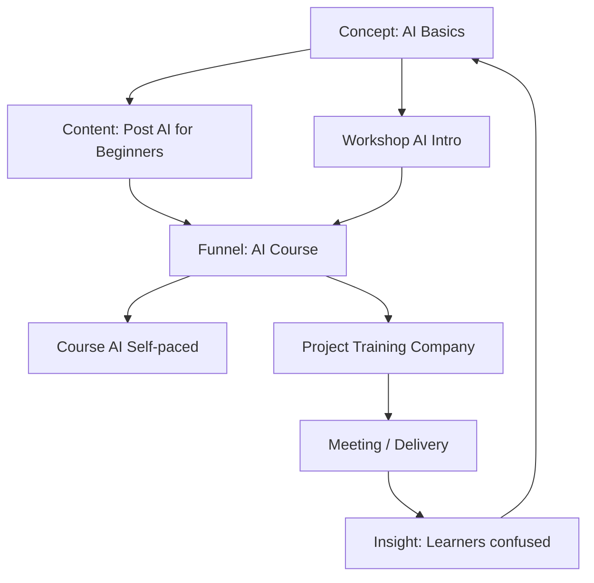

---

# 🧠 4. Insight quan trọng (điểm khác biệt)

## ❌ Cách sai (đa số làm)
- Concept đứng riêng
- Content đứng riêng
- Funnel ở ngoài (Excel / đầu)

👉 hệ chết, không học được từ chính mình

---

## ✅ Cách đúng (bạn đang build)

> Funnel KHÔNG phải business layer  
> 👉 nó là **node trong graph tri thức**

---

# 🎯 5. Rule link đơn giản (rất đáng nhớ)

Mỗi note luôn có:

- **FROM đâu?** (nguồn)
- **USED ở đâu?** (ứng dụng)
- **LEADS TO gì?** (output)

---

# 🔄 6. Flow sống (quan trọng nhất)

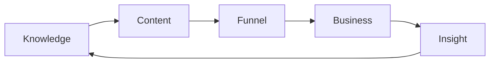

👉 Đây là vòng lặp giúp bạn:
- càng dạy → càng giỏi
- càng làm → càng refine hệ thống

---

# ⚠️ 7. Lưu ý thực tế

- Không cần link 100% → chỉ link **cái có giá trị**
- Funnel note nên ít nhưng rõ
- Concept là “single source of truth”

---

# 🧠 Kết luận

Bạn đang build không phải Obsidian note nữa, mà là:

> **hệ thống chuyển hoá tri thức → content → tiền → tri thức**

---

## Nếu bạn muốn nâng cấp tiếp

Tôi có thể:
- thiết kế **tag + query để track funnel performance**
- hoặc build **dashboard: content nào convert tốt → highlight**

→ đây là bước biến PKM thành **business intelligence system**

---

# you asked

mình còn 1 nhu cầu là nghiên cứu bài báo khoa học để làm luận và viết báo nữa. Check lại hệ thống này như thế nào và luồng thế nào, vẽ kết hợp nếu cần thiết

---

# chatgpt response

Tốt — khi bạn thêm **research (đọc paper, viết luận, viết báo)** thì hệ thống hiện tại **vẫn dùng được**, nhưng cần **bổ sung 1 layer “scholarly workflow”**. Nếu không làm rõ layer này, bạn sẽ gặp vấn đề:

- note rời rạc (paper đọc xong không dùng lại)
- khó tổng hợp khi viết luận/bài báo
- không nối được với teaching/business

Tôi sẽ:
1. **Audit hệ thống hiện tại**
2. **Thêm structure cho research**
3. **Thiết kế flow end-to-end**
4. **Vẽ graph tổng hợp (Mermaid)**

---

# 🧠 1. Audit hệ thống hiện tại (ngắn gọn, thẳng)

### ✅ Đang đúng:
- PARA làm backbone → ổn
- Graph logic → rất tốt
- Teaching ↔ Business ↔ Knowledge → đã connect

---

### ⚠️ Thiếu:
> **Research workflow riêng biệt (paper → synthesis → output)**

Hiện tại bạn mới có:
- Concept note
- Content note

👉 Nhưng research cần thêm:
- literature layer
- synthesis layer
- writing layer

---

# 🧩 2. Bổ sung cấu trúc cho Research

## 🔹 Trong `03_RESOURCES` thêm:

``` id="g4zbnv"
03_RESOURCES/
  - Papers/
  - Concepts/
  - Topics/
```

---

## 🔹 Thêm 3 loại note mới

---

### 📄 1. Paper Note (literature)

```markdown id="xfxyqt"
# Paper: Title

## Citation
-

## Key Idea
-

## Method
-

## Findings
-

## Related Concepts
- [[AI Basics]]

## Use in
- [[Topic: AI Education]]
```

👉 mỗi paper = 1 note

---

### 📄 2. Topic Note (synthesis – cực quan trọng)

```markdown id="ht3m0q"
# Topic: AI in Education

## Summary
-

## Key Papers
- [[Paper A]]
- [[Paper B]]

## Concepts
- [[AI Basics]]

## Open Questions
-

## Use for
- [[Thesis_AI_Education]]
```

👉 đây là nơi bạn “nghĩ thật sự”

---

### 📄 3. Writing Note (output)

```markdown id="p7ox5k"
# Paper Draft: AI Education

## Argument
-

## Based on
- [[Topic: AI in Education]]

## Citations
- [[Paper A]]

## Sections
-
```

---

# 🔄 3. Flow Research chuẩn

## 🧠 Logic:

``` id="17h92d"
Paper → Concept → Topic → Writing → Output
```

---

## 🔥 Flow chi tiết

### 1. Đọc paper
→ tạo `Paper Note`

---

### 2. Extract concept
→ link vào `Concept`

---

### 3. Gom thành Topic
→ synthesis nhiều paper

---

### 4. Viết
→ dùng Topic + Concept

---

### 5. Feedback
→ quay lại refine

---

# 🔗 4. Link với hệ thống cũ (điểm mạnh nhất)

## 🎯 Đây là chỗ bạn hơn người khác:

### Concept dùng chung cho:
- Teaching
- Content
- Research

---

## Ví dụ:

``` id="4zybqs"
[AI Basics]
   ↙        ↓        ↘
Teaching   Content   Research
```

---

## 👉 Nghĩa là:

- bạn dạy tốt hơn → vì có research
- bạn viết tốt hơn → vì có teaching insight
- bạn làm research thực tế hơn → vì có business

---

# 🔥 5. Mermaid – Graph tổng thể (quan trọng)

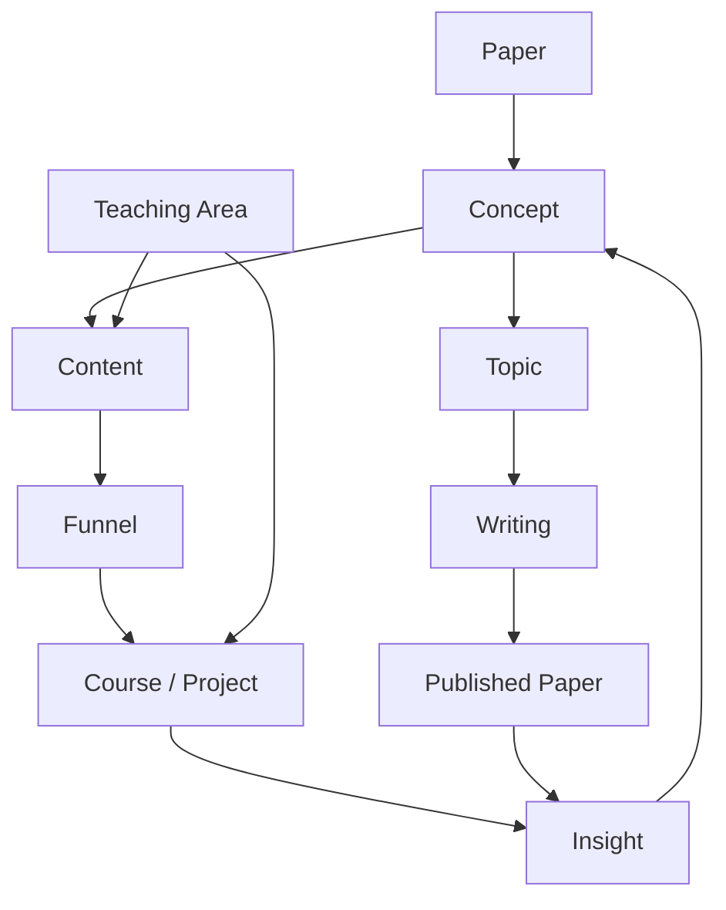

---

# 🧠 6. Luồng làm việc thực tế của bạn (rất cụ thể)

## 📚 Khi học / đọc paper

- tạo Paper note
- link concept

---

## 🧑‍🏫 Khi dạy

- dùng Concept + Topic
- tạo Insight

---

## ✍️ Khi viết luận / báo

- dùng Topic làm backbone
- kéo Paper vào

---

## 💰 Khi làm business

- dùng Content + Teaching
- generate Insight

---

## 🔁 Sau đó

- update Concept

---

# ⚠️ 7. Sai lầm cần tránh (research mode)

1. ❌ lưu paper nhưng không link
2. ❌ không tạo Topic (thiếu synthesis)
3. ❌ viết trực tiếp từ paper (không qua concept)
4. ❌ tách research khỏi teaching

---

# 🎯 8. Kết luận thẳng

Sau khi thêm research layer:

> Hệ của bạn trở thành:
**Knowledge Engine (học) + Teaching Engine (chia sẻ) + Business Engine (kiếm tiền)**

---

## 🧠 Rule quan trọng nhất

> ❌ Đừng nghĩ “paper để đọc”  
> ✅ Nghĩ “paper để nuôi concept → concept nuôi mọi thứ”

---

## Nếu bạn muốn nâng cấp thêm

Tôi có thể:
- build **citation workflow (Zotero + Obsidian)**  
- hoặc thiết kế **template viết paper chuẩn IMRAD trong Obsidian**

→ đây là bước biến system của bạn thành **academic-grade PKM**

---

# you asked

trong sơ đồ mermaid, ở mỗi bước (hãy ghi chú thêm folder - loại note) để rà soát cấu trúc vật lý và phân nhóm xem có hiệu quả ko. Đi theo từng nhu cầu để tổng hợp. Lấy ví dụ về ghi chú https://www.youtube.com/watch?v=wc4gqa3OUMU này. Xác nhận xem có xem ghi chú được ko, nếu được nãy đi tiếp

---

# chatgpt response

Tôi sẽ kiểm tra link YouTube đó trước để xác nhận mình đọc được những gì từ video này, rồi mới dựng sơ đồ Mermaid có folder và note type bám theo từng nhu cầu của bạn.

Hiện tại **tôi chưa đọc được nội dung video đó một cách đáng tin cậy**. Khi tôi thử mở trực tiếp link YouTube, phiên truy cập bị throttle; còn kết quả tìm kiếm không truy xuất ra được tiêu đề/nội dung đúng của video ID này, nên tôi không nên giả vờ “đã xem ghi chú” từ video đó. ([Website]())
Vì vậy, **chưa thể xác nhận là tôi xem được ghi chú của video này** nếu chỉ dựa vào link hiện tại. Cách chắc nhất để đi tiếp là bạn gửi một trong ba thứ sau:
- transcript của video,
- ảnh chụp hoặc text ghi chú bạn đã take,
- hoặc file/nội dung tóm tắt chính của video.

Khi có nội dung đó, tôi sẽ làm tiếp ngay:
1. rà soát lại cấu trúc vật lý theo từng nhu cầu,  
2. gắn **folder + loại note** vào từng node trong sơ đồ Mermaid,  
3. lấy chính ví dụ đó để kiểm thử xem luồng hiện tại có hiệu quả hay cần chỉnh.

---

# you asked

đây là transcript:

---

# chatgpt response

Đọc được rồi. Transcript bạn gửi đủ để dùng làm **ví dụ kiểm thử hệ thống note**. Nội dung cốt lõi của video là một vòng lặp học kỹ năng kiểu **on-demand learning**: học tối thiểu → thực hành sớm → tự đánh giá/lấy feedback → học bù đúng chỗ thiếu → lặp lại; kèm 3 bẫy lớn: sa vào tiêu thụ nội dung/đồ đạc, thiếu nhất quán, né thất bại.  

Tôi sẽ làm theo đúng yêu cầu của bạn:
1. rà theo **từng nhu cầu**,
2. gắn **folder + loại note** vào từng bước,
3. dùng chính video này để kiểm tra cấu trúc vật lý có hiệu quả không,
4. vẽ Mermaid để bạn nhìn được cả flow lẫn nơi lưu.

---

# 1. Kết luận trước: hệ hiện tại có ổn không?

**Có, nhưng cần chỉnh 2 điểm quan trọng** để phục vụ đồng thời:
- đời sống / tự học,
- giảng dạy / funnel,
- công việc partner,
- nghiên cứu paper / viết luận.

## Điểm cần chỉnh
Thay vì chỉ có:
- `01_PROJECTS`
- `02_AREAS`
- `03_RESOURCES`

nên tách rõ trong `03_RESOURCES`:

```text
03_RESOURCES/
  Concepts/
  Sources/
    Videos/
    Papers/
    Books/
  Topics/
  Teaching Assets/
```

Và thêm một nơi cho đầu ra đang viết:

```text
05_OUTPUTS/
  Content/
  Teaching/
  Research_Writing/
```

Lý do:
- **Source note** và **Concept note** không nên trộn.
- **Topic/Synthesis note** cần riêng để gom nhiều nguồn.
- **Output** cần riêng để tách “tri thức” khỏi “sản phẩm đang làm”.

---

# 2. Cấu trúc vật lý đề xuất, đã chỉnh

```text
00_INBOX/
01_PROJECTS/
02_AREAS/
03_RESOURCES/
  Concepts/
  Sources/
    Videos/
    Papers/
    Books/
  Topics/
  Teaching_Assets/
04_ARCHIVE/
05_OUTPUTS/
  Content/
  Teaching/
  Research_Writing/
99_SYSTEM/
  Templates/
  Dashboards/
  Maps/
```

---

# 3. Các loại note cốt lõi

## A. Source Note
Dùng cho video, paper, sách, podcast.

Ví dụ với transcript này:
- folder: `03_RESOURCES/Sources/Videos/`
- loại: `source note`

Tên note:
```text
2026-04 On-Demand Learning - video note
```

Vai trò:
- giữ nội dung gốc đã xử lý
- trích ý chính
- link sang concept/topic, không cố thành nơi “suy nghĩ cuối cùng”

---

## B. Concept Note
Dùng cho ý có thể tái sử dụng nhiều lần.

Ví dụ rút từ video:
- `Bare Minimum Theory`
- `Practice Before Mastery`
- `Evaluation and Feedback Loop`
- `Minimum Viable Equipment`
- `Accessory, Not Distraction`
- `Healthy Failure Zone`

Folder:
- `03_RESOURCES/Concepts/`

Vai trò:
- “single source of truth” cho từng idea

---

## C. Topic Note
Dùng để gom nhiều source và concept thành một chủ đề bạn đang học/viết/dạy.

Ví dụ:
- `Skill Acquisition`
- `Learning Design`
- `Practice-Based Learning`

Folder:
- `03_RESOURCES/Topics/`

Vai trò:
- synthesis
- cầu nối sang teaching/research/content

---

## D. Project Note
Dùng khi có deadline / deliverable.

Ví dụ:
- `Partner A - Internal Training Proposal`
- `Course Cohort Q3`
- `Paper Draft - Adult Learning`

Folder:
- `01_PROJECTS/`

---

## E. Output Note
Dùng cho thứ bạn xuất bản / trình bày / nộp.

Ví dụ:
- bài post chia sẻ
- lesson plan
- bài báo
- luận văn section

Folder:
- `05_OUTPUTS/...`

---

## F. Insight / Feedback Note
Dùng cho phản hồi từ học viên, partner, supervisor, reviewer, hoặc tự rút ra sau thực hành.

Có thể đặt ở:
- `03_RESOURCES/Concepts/` nếu nó là tri thức bền
- hoặc trong project nếu chỉ có tính cục bộ

---

# 4. Đi theo từng nhu cầu của bạn

## Nhu cầu 1: Tự học hàng ngày

### Luồng hợp lý
```text
Source → Concept → Topic → Practice Log / Daily Note → Insight → cập nhật Concept
```

### Dùng video này làm ví dụ

#### Bước 1: tạo source note
Folder:
```text
03_RESOURCES/Sources/Videos/
```

Note:
```text
2026-04 On-Demand Learning - video note
```

#### Bước 2: tách concept
Từ transcript có thể rút ra các concept như:
- học lý thuyết tối thiểu
- thực hành càng sớm càng tốt
- chỉ sửa 1–2 lỗi mỗi vòng
- feedback tăng tốc cải thiện
- kỹ năng nên là accessory của đời sống
- thất bại là dấu hiệu đang học
- mua đồ là cạm bẫy giả tiến bộ

Các điểm này đều có mặt rõ trong transcript.  

#### Bước 3: gom vào topic
Ví dụ topic:
```text
03_RESOURCES/Topics/Skill Acquisition
```

Trong topic đó link đến:
- video này
- paper về deliberate practice
- notes từ khóa học learning science

#### Bước 4: nối vào daily / practice
Ví dụ trong daily note:
```markdown
## Practice
- Applied [[Bare Minimum Theory]] to learning statistics today
- Need feedback on [[Evaluation and Feedback Loop]]
```

### Audit
Cho tự học, cấu trúc này **hiệu quả** vì:
- source không làm bẩn concept,
- concept tái dùng,
- topic giúp tổng hợp sâu,
- daily note giữ được “học đã đi vào hành động chưa”.

---

## Nhu cầu 2: Giảng dạy học viên

### Luồng hợp lý
```text
Concept → Teaching Asset → Lesson Plan / Session Project → Delivery → Feedback → cập nhật Concept
```

### Áp dụng video này
Từ video, bạn có thể tạo 1 lesson:
- chủ đề: “Học kỹ năng nhanh mà không sa vào analysis paralysis”

#### Cấu trúc
- `03_RESOURCES/Concepts/Bare Minimum Theory`
- `03_RESOURCES/Concepts/Practice Before Mastery`
- `03_RESOURCES/Teaching_Assets/Framework - On Demand Learning`
- `05_OUTPUTS/Teaching/Lesson - How to Learn a New Skill Quickly`
- nếu là deal cụ thể: `01_PROJECTS/Company X - Skill Learning Workshop`

### Audit
Cho giảng dạy, **cần thêm `Teaching_Assets/` là rất đáng**.  
Nếu không, lesson framework sẽ bị lẫn giữa concept thuần và output cụ thể.

---

## Nhu cầu 3: Chia sẻ kiến thức, build funnel

### Luồng hợp lý
```text
Concept/Topic → Content Draft → Published Content → Funnel Note → Project/Offer → Feedback
```

### Áp dụng video này
Bạn có thể biến video thành:
- 1 post: “Vì sao học nhiều mà vẫn không giỏi hơn”
- 1 workshop mini
- 1 email funnel về self-learning system

#### Cấu trúc
- `03_RESOURCES/Concepts/Accessory Not Distraction`
- `03_RESOURCES/Topics/Skill Acquisition`
- `05_OUTPUTS/Content/Post - Stop Learning Without Action`
- `99_SYSTEM/Maps/Funnel - Self Learning Offers`

#### Funnel note nên để đâu?
Tôi khuyên:
- **không để trong Projects**
- để ở:
```text
99_SYSTEM/Maps/
```
hoặc
```text
03_RESOURCES/Topics/Business_Funnels/
```

Vì funnel là **bản đồ hệ thống**, không phải một việc ngắn hạn.

### Audit
Cách này hiệu quả hơn việc nhét funnel vào project, vì funnel là cấu trúc tái dùng lâu dài.

---

## Nhu cầu 4: Partner / business deal

### Luồng hợp lý
```text
Funnel / Teaching Asset → Partner Project → Meeting Notes → Decision / Feedback → cập nhật asset và concept
```

### Ví dụ
Bạn dùng framework từ video để đề xuất workshop cho partner:
- `01_PROJECTS/Partner ABC - Learning Skills Workshop`
- trong đó link tới:
  - `03_RESOURCES/Teaching_Assets/Framework - On Demand Learning`
  - `05_OUTPUTS/Teaching/Deck - On Demand Learning Workshop`

### Audit
Phần này hiện tại hệ của bạn **ổn**, miễn là:
- meeting note ở project,
- concept không nằm trong project,
- decision note tách ra rõ.

---

## Nhu cầu 5: Nghiên cứu paper, làm luận, viết báo

### Luồng hợp lý
```text
Paper Source → Concept → Topic/Synthesis → Research Writing Project → Draft Output
```

### Áp dụng video này
Video này không phải paper, nhưng vẫn có thể là:
- nguồn gợi ý khái niệm thực hành
- một “entry point” để hình thành topic note

Ví dụ:
- `03_RESOURCES/Sources/Videos/2026-04 On-Demand Learning - video note`
- `03_RESOURCES/Concepts/Feedback Accelerates Learning`
- `03_RESOURCES/Topics/Practice-Based Learning`
- `01_PROJECTS/Paper - Adult Learning and Practice`
- `05_OUTPUTS/Research_Writing/Section - Discussion on iterative practice`

### Audit
Cho research, **bắt buộc** phải có:
- `Sources/Papers`
- `Topics`
- `Outputs/Research_Writing`

Nếu không, bạn sẽ rất dễ “đọc nhiều nhưng không synthesize”.

---

# 5. Mermaid tổng hợp, có folder + loại note

Đây là sơ đồ tổng quát nhất, bám theo từng nhu cầu:

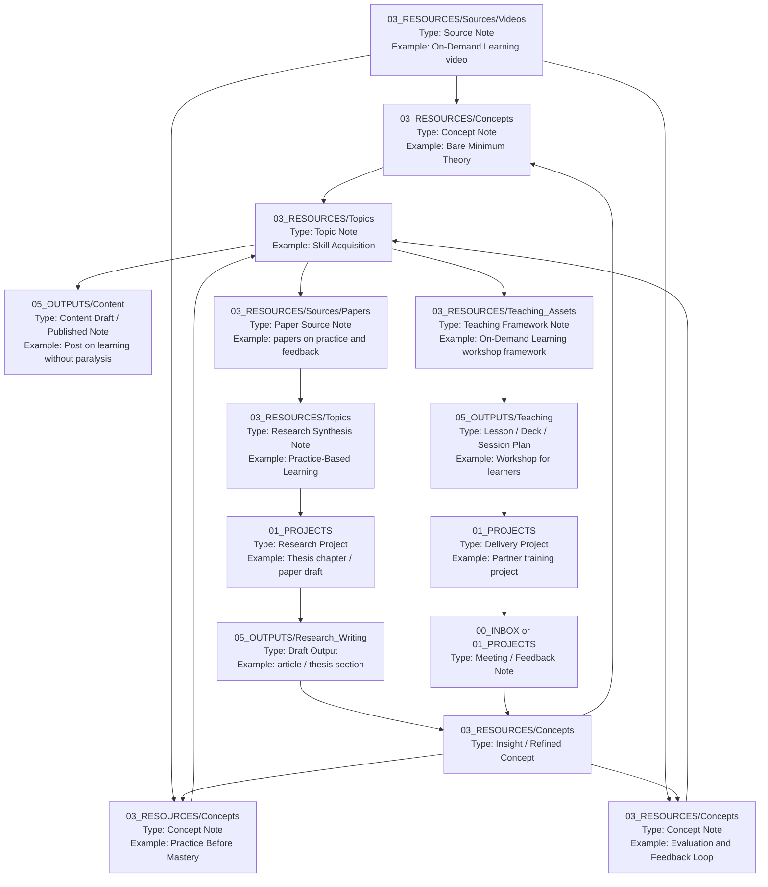

---

# 6. Mermaid theo từng nhu cầu

## 6.1. Tự học

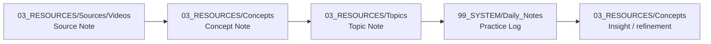

## 6.2. Giảng dạy

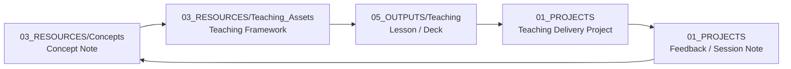

## 6.3. Funnel / chia sẻ

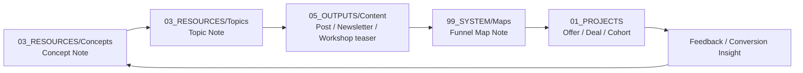

## 6.4. Research

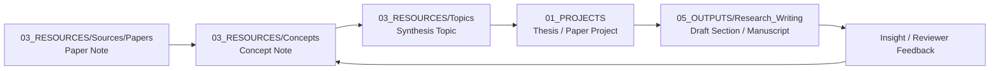

---

# 7. Ví dụ note thật từ video này

## 7.1. Source note
Folder:
```text
03_RESOURCES/Sources/Videos/
```

Tên:
```text
2026-04 On-Demand Learning - video note
```

Cấu trúc:
```markdown
# On-Demand Learning - video note

type:: source-note
source-type:: youtube-video

## Core claim
Learning feels productive when consuming content, but progress only happens when theory quickly turns into practice and iterative feedback.

## Main framework
1. [[Bare Minimum Theory]]
2. [[Practice Before Mastery]]
3. [[Evaluation and Feedback Loop]]

## Traps
- [[Consumerism Trap]]
- [[Accessory Not Distraction]]
- [[Healthy Failure Zone]]

## Related topics
- [[Skill Acquisition]]
- [[Practice-Based Learning]]
- [[Adult Learning]]
```

## 7.2. Concept note
Folder:
```text
03_RESOURCES/Concepts/
```

Tên:
```text
Bare Minimum Theory
```

```markdown
# Bare Minimum Theory

type:: concept-note

## Definition
Learn only the minimum theory needed to start practicing.

## Why it matters
Too much theory early creates analysis paralysis and the illusion of progress.

## Seen in
- [[2026-04 On-Demand Learning - video note]]

## Used in
- [[Framework - On Demand Learning]]
- [[Skill Acquisition]]

## Related
- [[Practice Before Mastery]]
```

Phần “bare minimum theory” và cảnh báo về analysis paralysis xuất hiện rất rõ trong transcript. 

## 7.3. Topic note
Folder:
```text
03_RESOURCES/Topics/
```

Tên:
```text
Skill Acquisition
```

```markdown
# Skill Acquisition

type:: topic-note

## Central question
How do people get competent quickly without drowning in theory?

## Key concepts
- [[Bare Minimum Theory]]
- [[Practice Before Mastery]]
- [[Evaluation and Feedback Loop]]
- [[Healthy Failure Zone]]

## Key sources
- [[2026-04 On-Demand Learning - video note]]

## Used for
- [[Post - Stop Learning Without Action]]
- [[Lesson - Learn Skills Faster]]
- [[Paper - Adult Learning and Practice]]
```

---

# 8. Archive nên xử lý thế nào?

Bạn nói rất đúng: “không biết trước note nào sẽ quay lại”.

Vậy tôi khuyên:

## Đừng archive concept/topic nếu còn giá trị tri thức
Chỉ archive:
- output cũ,
- project đóng,
- source note ít dùng.

## Và archive nên là “inactive”, không phải “dead”
Ví dụ:
- `04_ARCHIVE/Projects/...`
- `04_ARCHIVE/Outputs/...`

Nhưng:
- concept note vẫn nên ở `03_RESOURCES/Concepts`
- topic note vẫn nên ở `03_RESOURCES/Topics`

Như vậy graph không bị “chết”.

---

# 9. Kết luận rà soát

Sau khi kiểm thử với transcript này, tôi thấy cấu trúc hiệu quả nhất cho bạn là:

- **Projects** cho việc có outcome cụ thể
- **Areas** cho vai trò dài hạn
- **Resources/Concepts** cho tri thức tái dùng
- **Resources/Sources** cho tài liệu gốc
- **Resources/Topics** cho synthesis
- **Teaching_Assets** cho framework giảng dạy
- **Outputs** cho nội dung đang xuất ra
- **Maps** cho dashboard/funnel/system map

Điểm mấu chốt:
> **Nguồn ≠ khái niệm ≠ chủ đề ≠ đầu ra**

Nếu bạn trộn 4 thứ này vào nhau, hệ sẽ nhanh rối. Nếu tách đúng, hệ sẽ sống rất lâu.

Bước tiếp theo nên làm là **thiết kế naming convention + template YAML/properties cho từng loại note**, vì đó là thứ giúp hệ này vận hành mượt trong Obsidian chứ không chỉ đẹp trên sơ đồ.

---

# you asked

chưa hiểu mục 05_OUTPUTS/ và Output trong 01_PROJECTS/Partner A - Internal Training Proposal khác nhau như thế nào?
Sơ đồ mermaid có thể ghi chú thêm nhu cầu để đối chiếu với flow của nhu cầu, hoặc thêm màu của mũi tên (nếu có thể).
Luồng cho việc co-work với AI như luồng này, sẽ có rât nhiều thông tin, nhiều chặng cho 1 hội thoại, cần lưu lại nội dung thì thế nào (để áp dụng ngay bây giờ lun - tránh trôi thông tin). Bổ sung luồng này và các nhu cầu của tôi.

---

# chatgpt response

Câu hỏi của bạn đang đi vào **phần quan trọng nhất của PKM: phân biệt “knowledge vs work vs output” + kiểm soát flow thông tin (đặc biệt với AI)**. Tôi sẽ làm rõ rất thẳng và thực dụng.

---

# 🧠 1. Phân biệt: `05_OUTPUTS` vs Output trong `PROJECT`

## 🔥 Nguyên tắc cốt lõi

> **PROJECT = nơi bạn làm việc**  
> **OUTPUT = thứ bạn tạo ra để dùng / chia sẻ / tái sử dụng**

---

## 🔹 01_PROJECTS (work context)

Ví dụ:
```text
01_PROJECTS/Partner A - Internal Training Proposal/
```

Trong đó có thể có:
- draft proposal
- meeting note
- task
- version chưa hoàn chỉnh

👉 Đây là:
> **workspace tạm thời, messy, context-specific**

---

## 🔹 05_OUTPUTS (clean artifact)

Ví dụ:
```text
05_OUTPUTS/Teaching/Proposal - Internal Training Framework v1
```

👉 Đây là:
> **phiên bản đã đủ “sạch” để reuse / share / scale**

---

## ⚠️ So sánh trực diện

| Tiêu chí | PROJECT | OUTPUT |
|----------|--------|--------|
| Mục đích | làm việc | sử dụng |
| Tính ổn định | thấp | cao |
| Phụ thuộc context | cao | thấp |
| Tái sử dụng | khó | dễ |
| Mức độ sạch | messy | clean |

---

## 🎯 Ví dụ đúng case của bạn

Bạn làm proposal cho Partner A:

### Trong PROJECT:
```markdown
# Proposal Draft

- idea A
- note từ meeting
- chỉnh sửa nhiều lần
```

### Sau khi xong → move hoặc copy sang OUTPUT:
```markdown
# Training Proposal Framework

- structure chuẩn
- reusable
- không phụ thuộc Partner A
```

👉 Từ đó:
- lần sau làm Partner B → reuse 80%

---

# 🧠 2. Mermaid có gắn nhu cầu + màu flow

Tôi sẽ encode:

- 🔵 self-learning
- 🟢 teaching
- 🟡 business
- 🔴 research
- 🟣 AI co-work

---

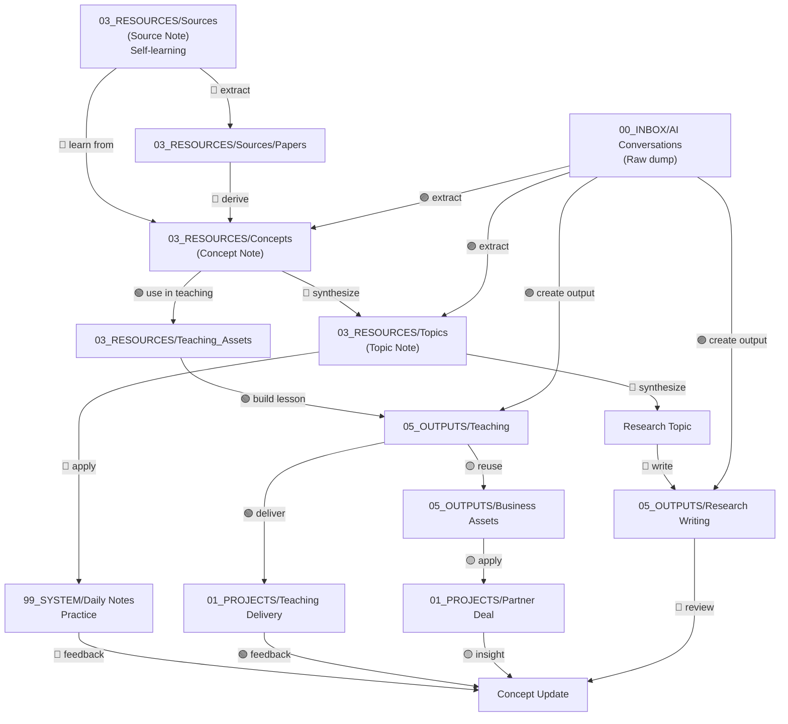

---

# 🧠 3. Luồng làm việc với AI (rất quan trọng cho bạn)

Bạn nói đúng:
> “AI → rất nhiều thông tin → nhiều chặng → dễ trôi”

👉 Đây là vấn đề lớn nếu không thiết kế flow.

---

## 🔥 Giải pháp: thêm 1 layer riêng

```text
00_INBOX/AI/
```

---

## 🔹 Bước 1: Capture nguyên bản (KHÔNG suy nghĩ)

Tạo note:

```text
00_INBOX/AI/2026-04-23 PKM discussion with ChatGPT.md
```

👉 paste toàn bộ conversation quan trọng

---

## 🔹 Bước 2: Extract (cực quan trọng)

Từ AI note → bạn tách:

- concept
- framework
- flow

Ví dụ từ cuộc chat này:

```text
03_RESOURCES/Concepts/
  - Knowledge vs Output
  - PKM Flow Design
  - AI Co-work Loop
```

---

## 🔹 Bước 3: Map vào hệ

- teaching → Teaching_Assets
- research → Topic
- business → Output

---

## 🔹 Bước 4: discard phần còn lại

👉 80% content AI không cần giữ

---

# 🧠 4. Mermaid riêng cho AI co-work

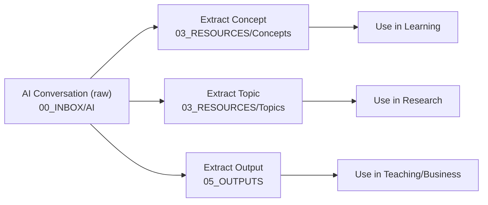

---

# 🧠 5. Rule vàng khi làm việc với AI

## ❌ Sai
- lưu toàn bộ chat
- không extract
- không link

👉 dẫn đến:
> information graveyard

---

## ✅ Đúng

> AI chỉ là **input**, không phải hệ thống

---

## 🔥 3 câu hỏi bắt buộc sau mỗi session AI:

1. Có concept nào đáng giữ không?
2. Có thể reuse thành asset không?
3. Có ảnh hưởng đến hệ hiện tại không?

---

# 🧠 6. Mapping tất cả nhu cầu của bạn

| Nhu cầu | Flow chính |
|--------|----------|
| Tự học | Source → Concept → Topic |
| Giảng dạy | Concept → Teaching Asset → Output |
| Funnel | Concept → Content → Output → Project |
| Partner | Output → Project → Insight |
| Research | Paper → Concept → Topic → Writing |
| AI co-work | AI → Extract → map vào tất cả |

---

# 🎯 7. Kết luận thẳng

Bạn đang build 1 hệ có 3 tầng:

1. **Knowledge (Concept / Topic)**
2. **Work (Project)**
3. **Output (Reusable asset)**

+ thêm:
4. **AI = input accelerator**

---

## ⚡ Câu quan trọng nhất

> ❌ Đừng hỏi “note này để đâu”  
> ✅ Hỏi “note này là knowledge, work hay output?”

---

## Nếu bạn làm đúng:

- bạn không bị trôi thông tin AI
- bạn reuse được teaching/business
- bạn build được hệ tri thức lâu dài

---

## Nếu muốn bước tiếp theo (rất đáng)

Tôi có thể:
- thiết kế luôn **template chuẩn cho AI capture → extract → reuse**
- hoặc build **dashboard auto show: concept mới từ AI + output pending**

→ đây là bước biến hệ của bạn thành **knowledge operating system thực sự**

---

# you asked

1. tôi còn 1 nhu cầu nữa là tối đa hoá việc tiếp xúc tiếng anh trong tất cả các hoạt động trên. Ưu tiên hoạt động chỉ làm 1 mình với AI để có phản hồi từ AI.
2. chưa hiểu ý bạn chỗ này: dashboard auto show: concept mới từ AI + output pending
3. tôi cũng cần template chuẩn từ AI capture để lưu lại cuộc hội thoại này ngay bây giờ.

---

# chatgpt response

Tốt — bây giờ hệ của bạn đã chuyển từ “quản lý note” → **operating system cho học + làm + suy nghĩ + AI**. Tôi sẽ trả lời 3 ý rất cụ thể, không lý thuyết.

---

# 🧠 1. Tối đa hoá tiếng Anh (embedded vào toàn hệ)

Bạn không nên “học tiếng Anh riêng”.  
👉 Bạn nên **biến toàn bộ hệ thành English-first system**

---

## 🔥 Nguyên tắc

> ❌ học tiếng Anh = activity riêng  
> ✅ dùng tiếng Anh = môi trường mặc định

---

## 🎯 Áp dụng vào hệ hiện tại

### 🔹 Rule 1: Tất cả note core = tiếng Anh

| Loại note | Ngôn ngữ |
|----------|----------|
| Concept | EN |
| Topic | EN |
| Teaching Asset | EN |
| Output (draft) | EN |
| Research | EN |

👉 chỉ cho phép:
- VN = ghi nhanh / reflection cá nhân

---

### 🔹 Rule 2: AI = English mode 100%

Khi làm việc với AI:
- prompt bằng tiếng Anh
- yêu cầu AI:
  - sửa grammar
  - suggest better phrasing
  - challenge logic

Ví dụ:

```text
Correct my English + improve clarity + challenge assumptions.
```

---

### 🔹 Rule 3: thêm loop “language feedback”

Trong mọi flow, thêm bước:

```text
Output → AI review → refine language
```

---

## 🔄 Mermaid thêm layer English

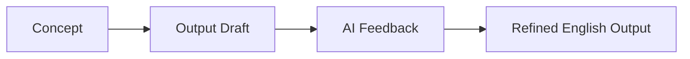

---

## 🔥 Use case thực tế của bạn

### Khi viết:
- lesson
- post
- proposal

👉 luôn:
1. viết EN
2. gửi AI refine
3. lưu version final

---

## 🧠 Bonus (rất mạnh)

Tạo concept riêng:

```text
03_RESOURCES/Concepts/Language Patterns/
```

Ví dụ:
- “explaining simply”
- “giving feedback”
- “structuring argument”

👉 bạn sẽ:
> học tiếng Anh theo **context thực**, không phải textbook

---

# 🧠 2. “Dashboard auto show concept mới từ AI + output pending” là gì?

Tôi nói đơn giản:

> Dashboard = nơi bạn nhìn thấy:
- cái gì mới học (từ AI)
- cái gì chưa làm xong

---

## 🔹 Vấn đề hiện tại (nếu không có dashboard)

- AI → nhiều insight → trôi
- Output → dang dở → quên

---

## 🔹 Giải pháp

Dùng **query (Dataview)** trong Obsidian

---

## 🔥 Ví dụ dashboard

File:
```text
99_SYSTEM/Dashboard.md
```

---

### 📌 1. Concept mới từ AI

```markdown
## 🧠 New Concepts (AI-derived)

```dataview
table file.mtime as "Updated"
from "03_RESOURCES/Concepts"
where contains(tags, "from-ai")
sort file.mtime desc
limit 10
```
```

---

### 📌 2. Output đang pending

```markdown
## 🚀 Output Pending

```dataview
table status
from "05_OUTPUTS"
where status = "draft"
```
```

---

### 📌 3. Project active

```markdown
## 🔥 Active Projects

```dataview
list
from "01_PROJECTS"
where status != "done"
```
```

---

## 🧠 Ý nghĩa thật

Dashboard giúp bạn trả lời mỗi ngày:

> “Hôm nay mình nên làm gì với tri thức mình có?”

---

# 🧠 3. Template chuẩn: AI Capture → Extract → Reuse

Áp dụng NGAY cho cuộc chat này.

---

## 📄 1. AI Capture Note (raw)

Folder:
```text
00_INBOX/AI/
```

---

### Template:

```markdown
# AI Session: {{title}}

date:: {{date}}
type:: ai-capture
status:: raw

## 🎯 Goal
- 

## 💬 Conversation (raw)
(paste toàn bộ chat)

---

## ⚡ Key Insights (quick)
- 

## ❗ Actionable Ideas
- 

## 🧠 Extract candidates
- concept:
- topic:
- output:

---

## 🔗 Link later
- 
```

---

## 📄 2. AI Extract Note (processed)

Sau khi đọc lại:

```markdown
# AI Extract: {{topic}}

type:: ai-extract

## Concepts
- [[Knowledge vs Output]]
- [[AI Co-work Loop]]

## Topics
- [[PKM System Design]]

## Outputs
- [[Obsidian System Design v1]]

## Actions
- build dashboard
- refine templates
```

---

## 📄 3. Add tag để dashboard đọc

Ví dụ concept:

```markdown
tags:: from-ai
```

---

# 🔄 4. Flow hoàn chỉnh với AI

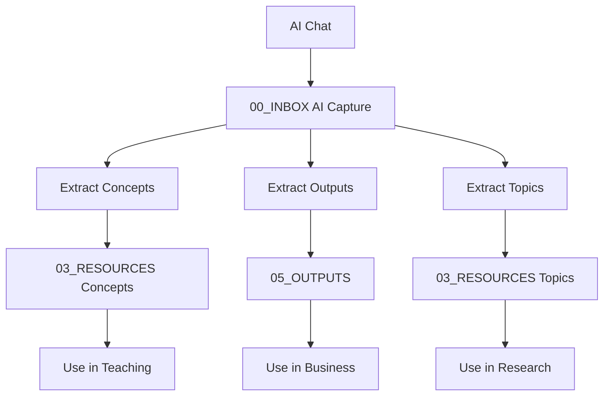

---

# 🎯 5. Áp dụng NGAY cho bạn (rất cụ thể)

Sau khi chat xong:

### Bước 1:
Tạo file:

```text
00_INBOX/AI/2026-04-23 PKM System Design.md
```

→ paste toàn bộ chat

---

### Bước 2:
Extract:

Concept:
- Knowledge vs Output
- AI Co-work Loop
- PKM Flow System

---

### Bước 3:
Tạo:

```text
03_RESOURCES/Concepts/AI Co-work Loop.md
```

---

### Bước 4:
Tạo output:

```text
05_OUTPUTS/System/Obsidian PKM v1.md
```

---

# 🧠 Kết luận

Bạn đang build:

> **1 hệ thống mà:**
- học → bằng tiếng Anh
- làm → bằng logic system
- AI → tăng tốc
- output → tái sử dụng

---

## ⚡ 3 rule cuối (rất đáng nhớ)

1. AI → luôn extract  
2. Concept → luôn reusable  
3. Output → luôn clean  

---

Nếu bạn muốn bước tiếp theo:

👉 tôi có thể build:
- **template cho writing paper (IMRAD + AI loop)**
- hoặc **template teaching + English refinement loop**

→ đây là bước đưa hệ bạn từ “tốt” → “professional level”