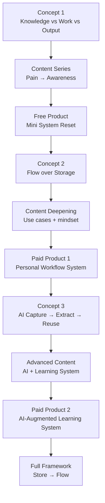

> 1. roadmap hãy vẽ lại theo mermaid.
2. Sản phẩm đầu tiên làm phễu (giá trị nhưng free). Sản phẩm trả phí sau đó và sau đó nữa.
3. Tôi cần danh sách idea trong 30 ngày liên tục để nền tảng nhận diện và phân phối tôi tới khách hàng tiềm năng, chưa bán vội nhưng có thể seeding dần.
4. Gợi ý kênh

# 🧭 1. Roadmap

👉 Logic:

- đi từ **pain → clarity → system → AI → full model**
- không “dạy hết” từ đầu

---

# 🎁 2. Product Ladder (Free → Paid → High Value)

## 🥇 Free (Lead Magnet – cực quan trọng)

### 🎯 Tên gợi ý:

**“Reset cách học & làm việc trong 60 phút”**

### Format:

- PDF + video ngắn (hoặc Notion/Obsidian template)

### Nội dung:

- giải thích Knowledge vs Work vs Output
- audit bản thân
- 1 mini system setup

👉 Goal:

- “aha moment”
- họ thấy: _mình đang làm sai cách_

---

## 💰 Paid 1 (Low ticket – dễ mua)

### 🎯 Tên:

**“Personal Workflow System (Store → Flow Lite)”**

### Nội dung:

- setup hệ cá nhân (Obsidian / Drive)
- cách biến knowledge → output
- case PMP / công việc thực

👉 Giá:

- 300k – 1tr

👉 Goal:

- chuyển từ “hiểu” → “làm được”

---

## 💎 Paid 2 (Core offer)

### 🎯 Tên:

**“AI-Augmented Learning System”**

### Nội dung:

- AI workflow (capture → extract → reuse)
- learning system có feedback loop
- áp dụng cho:
    - PMP
    - skill learning

👉 Giá:

- 2tr – 5tr+

👉 Goal:

- transformation thật

---

## 🚀 Future (high-end)

- Corporate training
- Consulting
- Adaptive learning system (align thesis)

---

# 📆 3. 30-Day Content Ideas (không bán, build nhận diện)

👉 Strategy:

- 70% pain + awareness
- 20% framework
- 10% seeding

---

## 🔥 Week 1: Pain (đánh trúng vấn đề)

1. Bạn học rất nhiều nhưng vẫn không giỏi hơn?
2. Vì sao mỗi lần làm lại phải bắt đầu từ đầu?
3. Bạn đang “lưu” hay đang “học”?
4. Sai lầm lớn nhất khi ghi chú
5. Vì sao Notion/Obsidian không giúp bạn giỏi hơn
6. Bạn có hàng trăm file nhưng không dùng được
7. Cảm giác “bận học” nhưng không tiến bộ

---

## 🧠 Week 2: Clarity (introduce concept)

8. 3 thứ bạn đang trộn lẫn (Knowledge/Work/Output)
9. Người giỏi không học nhiều hơn bạn
10. Học ≠ lưu
11. Vì sao bạn không reuse được kiến thức
12. Khác biệt giữa người làm và người tiến bộ
13. Tại sao note của bạn không có giá trị
14. Bạn đang dùng não như ổ cứng

---

## ⚙️ Week 3: System thinking

15. Cách tổ chức lại toàn bộ hệ học/làm việc
16. Một system đơn giản giúp bạn đỡ overload
17. Flow > Storage là gì?
18. Vì sao bạn nên bỏ 80% note
19. Cách biến 1 ý thành nhiều giá trị
20. Tư duy system vs tư duy tool
21. Bạn không cần app mới, bạn cần logic mới

---

## 🤖 Week 4: AI + nhẹ seeding

22. Dùng AI mà vẫn không giỏi hơn – vì sao?
23. Sai lầm khi dùng ChatGPT
24. AI không giúp bạn nếu bạn không có system
25. Cách tôi dùng AI để không bị phụ thuộc
26. 1 cuộc chat → 10 concept (demo)
27. Vì sao AI nên là “trợ lý”, không phải “não”
28. Cách tôi extract knowledge từ AI

---

## 🌱 Seeding (xen kẽ)

29. Tôi đang build 1 system giúp học hiệu quả hơn
30. Sắp chia sẻ cách reset toàn bộ cách học

---

# 📡 4. Kênh nên dùng (VN market – thực tế)

## 🥇 Facebook (main channel)

- vì:
    - audience VN mạnh
    - dễ viral insight
    - phù hợp storytelling

👉 Dạng:

- post dài (insight)
- comment discussion

---

## 🥈 LinkedIn (secondary – high quality)

- phù hợp:
    - PMP
    - corporate
    - professional audience

👉 Dạng:

- case study
- framework
- thought leadership

---

## 🥉 TikTok / Reels (optional)

- nếu bạn muốn scale nhanh
- nhưng:
    - cần đơn giản hóa content

👉 Dạng:

- 30–60s insight
- 1 idea / video

---

## 🎯 Không nên bắt đầu với

- YouTube dài (tốn effort)
- blog riêng (traffic thấp ban đầu)

---

# 🧠 Final Strategy (rất quan trọng)

## ❌ Sai lầm

- dạy quá nhiều
- nói quá phức tạp
- build system trước khi có audience

---

## ✅ Đúng

> bắt đầu từ 1 concept đơn giản  
> → lặp lại nhiều lần  
> → build trust  
> → sau đó mới bán

---

# 🚀 Nếu bạn muốn đi bước tiếp

Tôi có thể:

👉 viết luôn:

- **5 bài post đầu tiên (high-impact, đúng voice VN)**
- hoặc
- **script video ngắn 30–60s**

Chỉ cần nói:  
**“write first 5 posts”** hoặc **“build video scripts”**