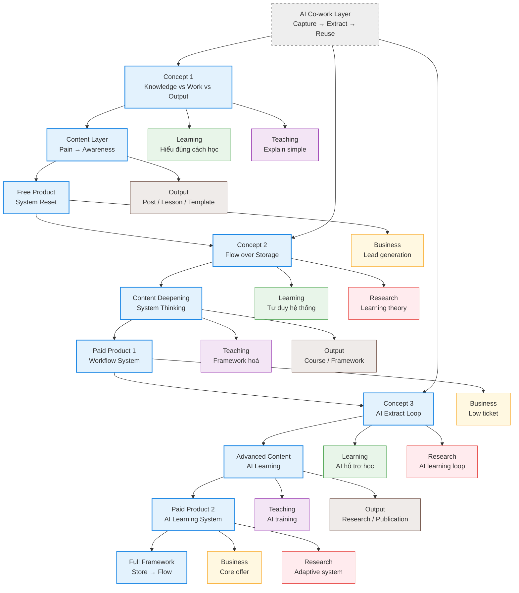

**build full system map**

Dưới đây là bản **system map hoàn chỉnh**, đã tích hợp:

- Funnel (concept → product)
- 4 nhu cầu của bạn (Learning / Teaching / Business / Research)
- AI co-work layer
- Output layer

👉 Đây là **bản đồ điều hành**, không chỉ là roadmap.

---

# 🧭 FULL SYSTEM MAP (Mermaid – multi-layer)
![[Pasted image 20260424013814.png]]

# 🧠 Cách đọc bản đồ (rất quan trọng)

## 1. Trục dọc = Funnel chính

Concept → Content → Free → Paid → AI → Full System

👉 Đây là:

- hành trình khách hàng
- cũng là hành trình phát triển brand của bạn

---

## 2. Nhánh ngang = 4 “engine” của bạn

|Layer|Vai trò|
|---|---|
|Learning|bạn học|
|Teaching|bạn dạy|
|Business|bạn kiếm tiền|
|Research|bạn build học thuật|

👉 Điểm mạnh của bạn:

> 1 concept → chạy được cả 4 engine

---

## 3. AI layer = accelerator

- không đứng riêng
- gắn vào:
    - concept
    - system
    - research

👉 đúng triết lý của bạn:

> AI fast for human slow

---

## 4. Output layer = nơi tạo giá trị thật

- Post → nhận diện
- Course → tiền
- Research → uy tín

---

# 🎯 Insight chiến lược (rất quan trọng)

## 🔥 1. Bạn KHÔNG build nhiều thứ riêng lẻ

Bạn đang build:

> **1 system → nhiều output**

---

## 🔥 2. Mỗi content phải phục vụ 2–3 layer

Ví dụ:

- 1 post:
    - dạy (teaching)
    - build brand (business)
    - clarify concept (learning)

---

## 🔥 3. Research KHÔNG tách riêng

- dùng:
    - training center
    - learners

👉 đúng với profile practitioner–researcher của bạn

---

# ⚠️ Sai lầm cần tránh (rất sát bạn)

## ❌ 1. Build system quá sớm

- chưa có audience
- chưa validate pain

---

## ❌ 2. Dạy quá phức tạp từ đầu

- “Store → Flow” quá abstract
- cần entry concept đơn giản

---

## ❌ 3. Tách rời 4 engine

- học riêng
- dạy riêng
- business riêng

👉 mất leverage lớn nhất của bạn

---

# 🚀 Cách dùng bản đồ này ngay hôm nay

## Mỗi ngày, chỉ cần hỏi:

1. Tôi đang ở bước nào trong funnel?
2. Content này phục vụ layer nào?
3. Có output không?

---

# 🧠 Nếu nâng cấp tiếp (rất đáng)

Tôi có thể build thêm cho bạn:

### 1. Dashboard vận hành

- hôm nay làm gì theo system map

### 2. Mapping từng concept → content cụ thể

### 3. Script hóa toàn bộ funnel (post → lead → sale)

---

Chỉ cần nói:

👉 **“build execution dashboard”**  
hoặc  
👉 **“map concept → content cụ thể”**

→ lúc đó bạn sẽ chuyển từ “hiểu hệ” → “chạy hệ”