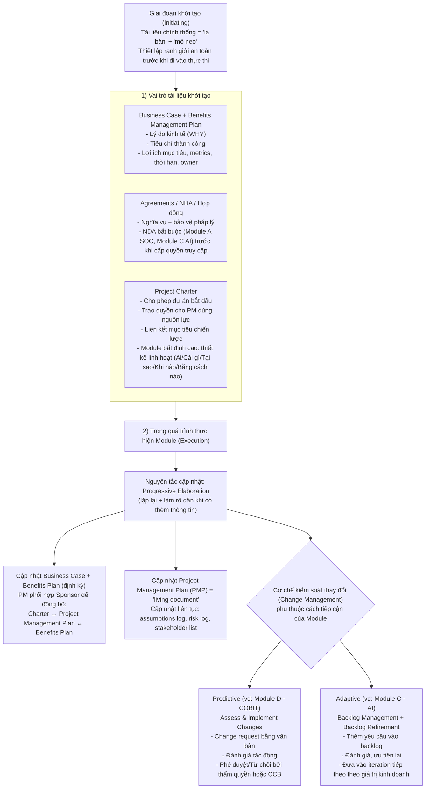

Hỏi: như vậy các tài liệu chính thống cần làm ban đầu sẽ thật sự cần trong giai đoạn đầu và cập nhật như thế nào trong quá trình thực hiện module?

Các tài liệu chính thống ban đầu đóng vai trò là "la bàn" định hướng và "mỏ neo" pháp lý, thiết lập ranh giới an toàn trước khi dự án đi vào vùng thực thi với nhiều yếu tố không chắc chắn. Dưới đây là lý do chúng thực sự cần thiết ở giai đoạn đầu và cách chúng được cập nhật theo chuẩn PMBOK8:

**1. Vai trò thực sự của các tài liệu trong giai đoạn khởi tạo**

- **Tài liệu kinh doanh (Business Case & Benefits Management Plan):** Cung cấp lý do kinh tế (WHY) để biện minh cho khoản đầu tư và định nghĩa các tiêu chí thành công, giúp Ban lãnh đạo quyết định có nên triển khai dự án hay không. Kế hoạch quản lý lợi ích xác định chính xác các lợi ích mục tiêu, thước đo (metrics), thời hạn và chủ sở hữu lợi ích. Điều này đặc biệt quan trọng để đánh giá xem dự án có mang lại giá trị như kỳ vọng hay không.
- **Thỏa thuận pháp lý (Agreements/NDA/Hợp đồng):** Xác định ý định ban đầu, các nghĩa vụ và bảo vệ pháp lý. Đối với Module A (SOC) và C (AI), NDA là rào chắn pháp lý bắt buộc phải có trước khi bất kỳ quyền truy cập hệ thống nào được cấp.
- **Tuyên ngôn dự án (Project Charter):** Chính thức cho phép dự án bắt đầu, trao quyền cho Giám đốc dự án được sử dụng nguồn lực của tổ chức và thiết lập sự liên kết giữa dự án với các mục tiêu chiến lược. Đối với các module có độ bất định cao (như thử nghiệm AI), Tuyên ngôn dự án có thể được thiết kế linh hoạt, chỉ tập trung trả lời các câu hỏi cốt lõi (Ai, Cái gì, Tại sao, Khi nào, Bằng cách nào) để cung cấp định hướng mà không trói buộc nhóm vào một phạm vi cứng nhắc.

**2. Cơ chế cập nhật tài liệu trong quá trình thực hiện Module** Quá trình cập nhật tài liệu tuân theo nguyên tắc **Làm rõ dần dần (Progressive Elaboration)**, nghĩa là các kế hoạch sẽ được lặp lại và chi tiết hóa liên tục khi có thêm thông tin và các ước tính trở nên chính xác hơn.

- **Cập nhật Tài liệu Kinh doanh và Tuyên ngôn dự án:** Business Case và Kế hoạch quản lý lợi ích được xem xét định kỳ trong suốt vòng đời dự án. Việc phát triển và duy trì Kế hoạch quản lý lợi ích là một hoạt động lặp đi lặp lại; Giám đốc dự án làm việc với nhà tài trợ (sponsor) để đảm bảo Tuyên ngôn dự án, Kế hoạch quản lý dự án và Kế hoạch quản lý lợi ích luôn đồng bộ với nhau.
- **Cập nhật Kế hoạch Quản lý Dự án (Project Management Plan):** Đây là một "tài liệu sống" (living document) được kỳ vọng sẽ thay đổi theo thời gian. Các tài liệu dự án cốt lõi như sổ ghi chép giả định, sổ ghi chép rủi ro, và danh sách các bên liên quan được cập nhật liên tục thông qua quá trình quản lý thực thi (Manage Project Execution) và kiểm soát dự án.
- **Cơ chế kiểm soát thay đổi (Change Management):** Tùy thuộc vào phương pháp tiếp cận của từng Module mà cách cập nhật các tài liệu và đường cơ sở (baseline) sẽ khác nhau:
    - _Với các thành phần Dự đoán (Predictive) (VD: Module D - Tiêu chuẩn COBIT):_ Mọi thay đổi về phạm vi, chi phí hoặc lịch trình đều phải thông qua quy trình **Đánh giá và Thực hiện Thay đổi (Assess and Implement Changes)**. Yêu cầu thay đổi phải được lập thành văn bản, đánh giá tác động, và được phê duyệt hoặc từ chối bởi người có thẩm quyền hoặc Hội đồng kiểm soát thay đổi (CCB).
    - _Với các thành phần Thích ứng (Adaptive) (VD: Module C - Ứng dụng AI):_ Việc cập nhật yêu cầu diễn ra linh hoạt thông qua **Quản lý danh mục tồn đọng (Backlog Management)**. Thay vì một quy trình phê duyệt yêu cầu thay đổi phức tạp, các yêu cầu mới từ các bên liên quan được thêm vào Backlog. Sau đó, thông qua quá trình **Tinh chỉnh danh mục (Backlog Refinement)**, các hạng mục này được đánh giá, ưu tiên lại và đưa vào vòng lặp (iteration) tiếp theo dựa trên giá trị kinh doanh

