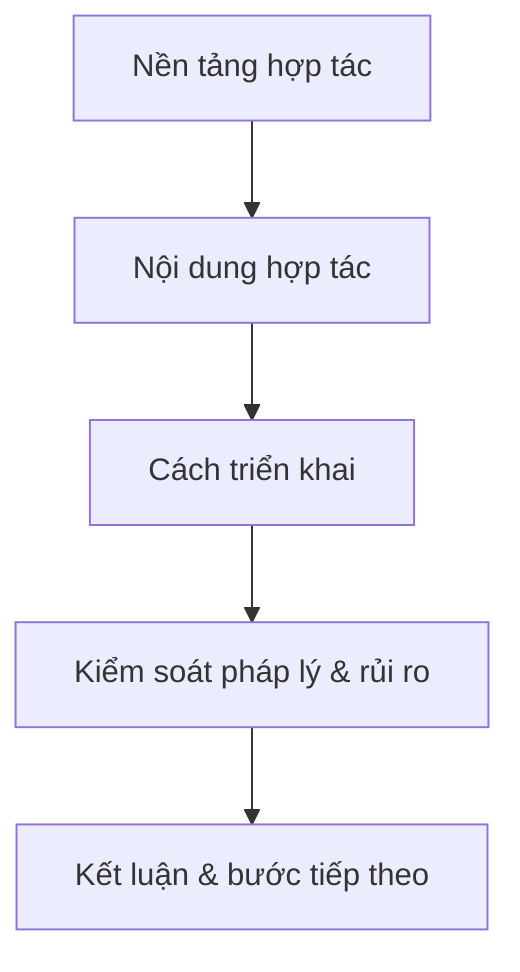
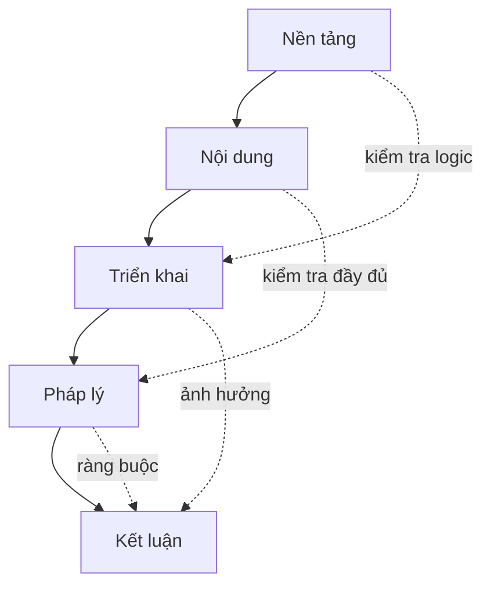

có thể gom nhóm lại giữa các thành phần không?

Cách hiểu đúng không phải là “5 nhóm đứng độc lập”, mà là **một chuỗi logic có quan hệ nhân–quả và kiểm soát lẫn nhau**.

# II. Ý NGHĨA MỐI LIÊN HỆ (QUAN TRỌNG)

### 1. Nền tảng → Nội dung

(Bối cảnh quyết định hợp tác cái gì)

- Nếu mục đích là “mở rộng thị trường”  
    → Nội dung sẽ là phân phối, marketing

👉 Sai ở đây → toàn bộ nội dung đi lệch hướng

---

### 2. Nội dung → Triển khai

(Làm cái gì quyết định làm như thế nào)

- Đã xác định hợp tác sản phẩm A  
    → phải có người phụ trách, timeline, nguồn lực

👉 Nếu thiếu bước này → MOU chỉ là “ý tưởng”, không chạy được

---

### 3. Triển khai → Kiểm soát pháp lý

(Càng làm cụ thể → càng phát sinh rủi ro cần kiểm soát)

- Có chia dữ liệu → cần bảo mật
- Có tạo sản phẩm → cần xác định quyền sở hữu

👉 Đây là lớp “bảo vệ”

---

### 4. Kiểm soát → Kết luận

(Sau khi hiểu rủi ro → mới chốt được hành động)

- Biết cái gì chưa rõ → đưa vào việc cần làm tiếp
- Biết ràng buộc → quyết định có đi tiếp hay không

# III. MỐI LIÊN HỆ NGANG (KIỂM TRA CHÉO)

Không chỉ đi theo chiều dọc, mà còn có kiểm tra chéo:

### Ví dụ:

- Mục đích nói “hợp tác dài hạn”  
    → nhưng timeline chỉ 1 tháng → **lệch**
- Nội dung nói “chia doanh thu”  
    → nhưng không có điều khoản tài chính → **thiếu**

👉 Đây là cách phát hiện lỗi trong MOU

---

# IV. CÁCH NHÌN DỄ NHỚ (5 CÂU HỎI)

Bạn có thể nhớ bằng 1 chuỗi:

1. **Tại sao làm?** → Nền tảng
2. **Làm cái gì?** → Nội dung
3. **Làm như thế nào?** → Triển khai
4. **Có rủi ro gì?** → Kiểm soát
5. **Tiếp theo làm gì?** → Kết luận

---

# V. GÓC NHÌN NÂNG CAO (RẤT QUAN TRỌNG)

Một MOU tốt là khi:

- 5 nhóm **khớp logic với nhau**
- Không có mâu thuẫn giữa các phần
- Có thể chuyển sang hợp đồng chính thức mà không phải viết lại từ đầu

Ngược lại, MOU yếu thường có dấu hiệu:

- Nền tảng nói 1 kiểu, nội dung làm kiểu khác
- Có nội dung nhưng không có triển khai
- Có triển khai nhưng không có kiểm soát rủi ro