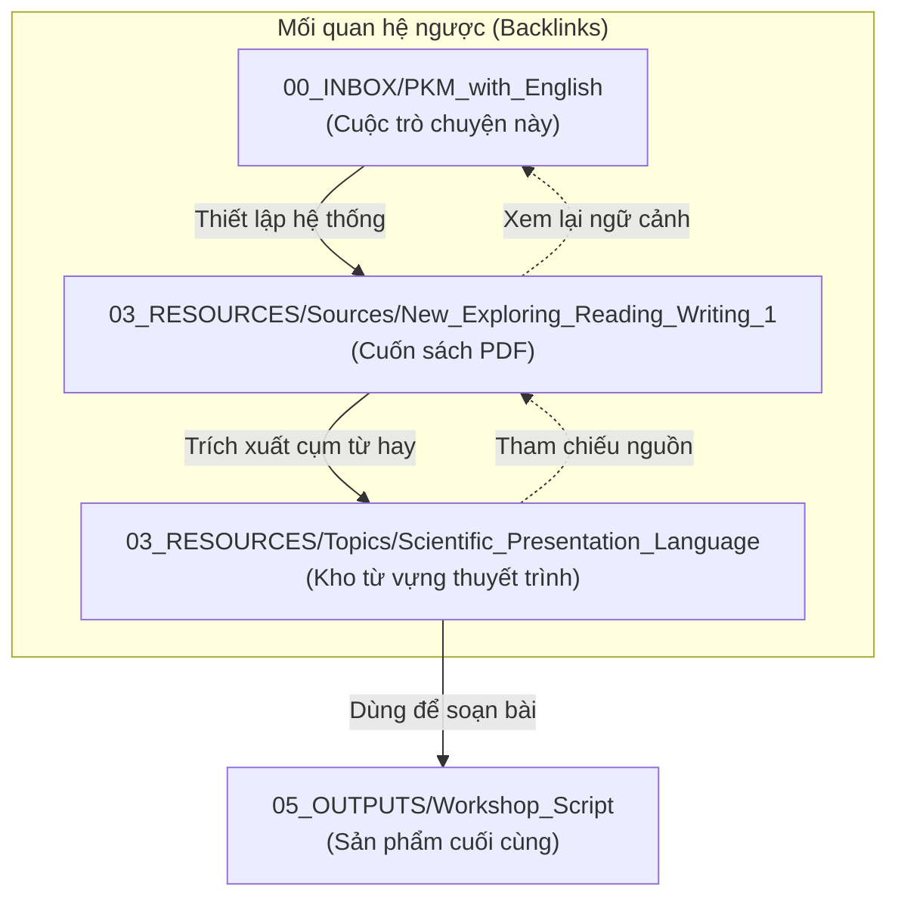

Context for: [[New Exploring Reading Writing 1]]


Since you asked for my advice again, I will sharpen the focus. My first recommendation was about **where** to put things; this advice is about **how to make the system work for your specific scientific goal** without creating extra work.

Here is my refined strategy for you:

---

### 1. The "Resource-First" Architecture

Do not treat this book as a "chore" to be finished. Treat it as a **database of phrases** for your future workshop.

- **Placement:** Keep the main note in `03_RESOURCES/Sources/New_Exploring_Reading_Writing_1.md`.
    
- **The Logic:** You are a scientist. You don't need to "finish" the book; you need to "mine" the book for language patterns.
    

### 2. The "Bridge" to your Scientific Workshop

To connect this book to your goal of presenting a paper, use a **Topic Note**:

- **Location:** `03_RESOURCES/Topics/Scientific_Presentation_Language.md`
    
- **The Action:** Every time you see a good sentence structure in the PDF, don't just leave it in the book note. **Copy it** to this Topic Note.
    
- **Why:** When it is time to write your workshop script, you won't look at the textbook notes; you will look at this "Scientific Presentation" note.
    

### 3. A "Low-Maintenance" Capture Workflow

To keep maintenance low (your constraint), follow the **80/20 Rule**:

- **80% of your time:** Reading the PDF and practicing.
    
- **20% of your time:** Updating **one** table in your Obsidian note.
    

---

### My Recommended Template (Copy/Paste this)

Create your note at `03_RESOURCES/Sources/New_Exploring_Reading_Writing_1.md` and use this structure:

Markdown

```
# New Exploring Reading and Writing 1
**Goal:** Extract academic English for scientific presentation.
**Parent Area:** [[02_AREAS/English]]

## 📈 Progress
- [ ] Unit 1: [Topic Name]
- [ ] Unit 2: [Topic Name]

## 🧪 Scientific "Swipe File"
*Capture phrases here that you can use in your workshop.*
- **To introduce a graph:** "As illustrated in the figure..."
- **To argue a point:** "This evidence suggests that..."

## 📝 Practice Essays
*Link your exercises here*
- [[05_OUTPUTS/Writing/Unit_1_Practice_Essay]]
```

---

### Why this works:

1. **Minimalist:** Everything about the book stays in **one** file.
    
2. **Reusable:** The "Scientific Swipe File" section is directly usable for your actual paper/workshop.
    
3. **Low Friction:** You don't have to think about where to put a new note. If it's from the book, it goes here.
    

### English Enhancement & Clarity

Since you are heading toward a scientific career, let's polish your request:

- **Original:** "please give me your advice again"
    
- **Professional Version:** "Could you please provide further recommendations?" or "I'd appreciate your further advice on this."
    
- **Key Concept:** In a scientific workshop, **conciseness** is power. Instead of saying "I want to be able to present a scientist workshop," say **"I aim to deliver a professional presentation at a scientific workshop."**
    

**Does this more focused "Scientific Swipe File" approach help you see how the book connects to your paper?**